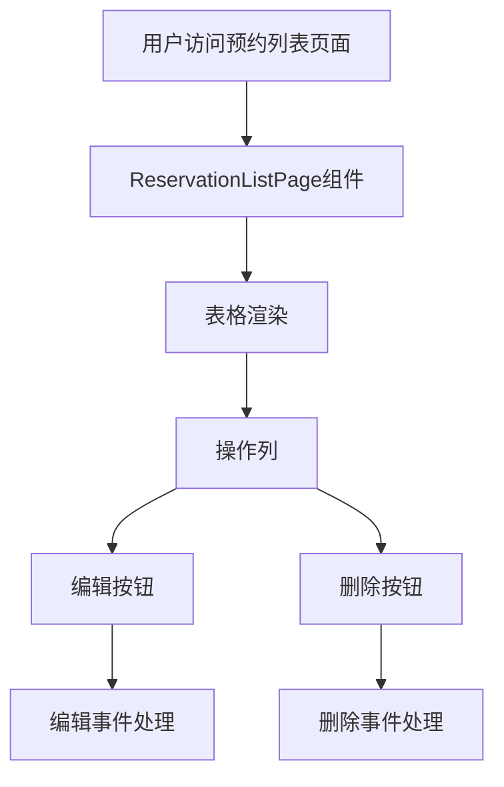

# 预约列表操作列设计文档

## 架构图

## 模块划分和依赖关系

| 模块 | 职责 | 依赖 |
|------|------|------|
| ReservationListPage | 预约列表页面组件 | Semi Design Table, Button组件 |
| 操作列 | 显示编辑和删除按钮 | Semi Design Button |
| 编辑按钮 | 触发编辑操作 | Button组件 |
| 删除按钮 | 触发删除操作 | Button组件 |

## 接口定义和数据流

### 组件接口
- `ReservationListPage`: 无特殊接口变更，内部添加操作列配置

### 数据流向
1. 表格数据加载完成后，渲染包含操作列的表格
2. 用户点击编辑/删除按钮，触发相应的处理函数
3. 处理函数目前仅打印日志，记录被操作的预约ID

## 错误处理机制
- 按钮点击事件添加try-catch处理，避免因后续逻辑错误影响页面功能
- 按钮交互状态管理，避免重复点击