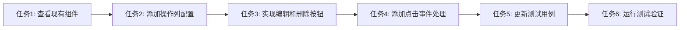

# 预约列表操作列任务拆分文档

## 任务列表

### 任务1：查看现有ReservationListPage组件实现
- **输入**：项目代码
- **输出**：了解现有表格结构和列配置
- **实现约束**：分析前端/ReservationListPage.tsx文件
- **依赖关系**：无

### 任务2：在ReservationListPage组件中添加操作列配置
- **输入**：任务1的分析结果
- **输出**：修改后的ReservationListPage组件，添加操作列
- **实现约束**：使用Semi Design的Table组件配置
- **依赖关系**：任务1

### 任务3：实现编辑和删除按钮组件
- **输入**：任务2的修改结果
- **输出**：操作列中包含编辑和删除按钮
- **实现约束**：使用Semi Design的Button组件，编辑使用主色调，删除使用危险色调
- **依赖关系**：任务2

### 任务4：添加按钮点击事件处理函数
- **输入**：任务3的实现结果
- **输出**：按钮具有点击事件处理能力
- **实现约束**：处理函数仅打印日志，记录被操作的预约ID
- **依赖关系**：任务3

### 任务5：更新ReservationListPage测试用例
- **输入**：任务4的实现结果
- **输出**：更新后的测试文件，验证操作列和按钮存在
- **实现约束**：添加测试断言验证操作列和按钮
- **依赖关系**：任务4

### 任务6：运行测试验证实现
- **输入**：任务5的测试文件
- **输出**：测试结果报告
- **实现约束**：所有测试必须通过
- **依赖关系**：任务5

## 任务依赖图
