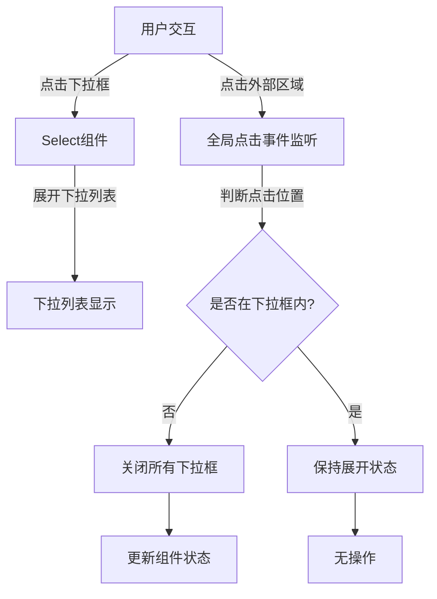
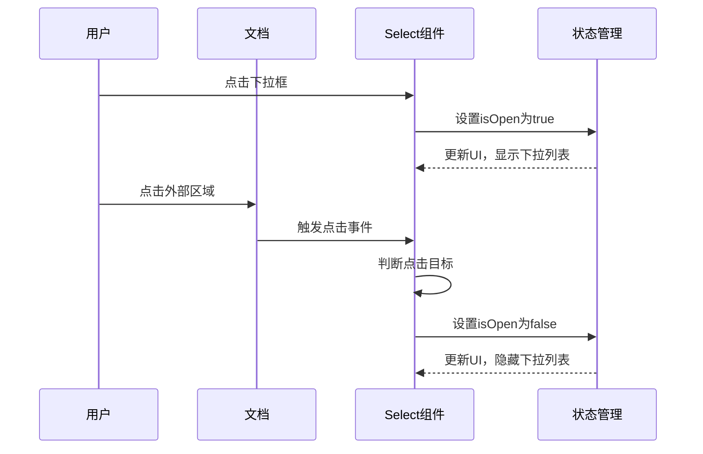

# 下拉框点击外部关闭功能设计文档

## 架构图


## 模块划分

### 1. 全局点击事件处理模块
- **功能**：监听document上的点击事件，判断点击位置
- **实现方式**：使用React的useEffect创建全局事件监听器
- **关键逻辑**：判断点击目标是否在下拉框组件内部

### 2. 下拉框状态管理模块
- **功能**：管理下拉框的展开/收起状态
- **实现方式**：使用React的useState或useReducer管理状态
- **状态定义**：
  - `isOpen`: boolean - 表示下拉框是否展开

### 3. 事件传播控制模块
- **功能**：控制事件的传播，避免点击下拉框内部时触发外部点击关闭
- **实现方式**：使用event.stopPropagation()方法

## 数据流



## 错误处理机制

1. **内存泄漏防护**：
   - 在组件卸载时正确清理事件监听器
   - 使用useEffect的清理函数移除事件监听

2. **事件冲突处理**：
   - 避免与页面其他事件监听器冲突
   - 确保不会干扰其他交互元素的正常工作

3. **边界情况处理**：
   - 处理多个下拉框同时展开的情况
   - 确保在iframe环境中也能正常工作
   - 处理快速连续点击的情况

## 代码结构

1. **自定义Hook实现**：
   ```typescript
   // useClickOutside.ts
   function useClickOutside(ref: React.RefObject<HTMLElement>, callback: () => void) {
     // 实现代码
   }
   ```

2. **Select组件集成**：
   ```typescript
   // 组件中使用
   const dropdownRef = useRef<HTMLDivElement>(null);
   const [isOpen, setIsOpen] = useState(false);
   
   useClickOutside(dropdownRef, () => {
     if (isOpen) {
       setIsOpen(false);
     }
   });
   ```