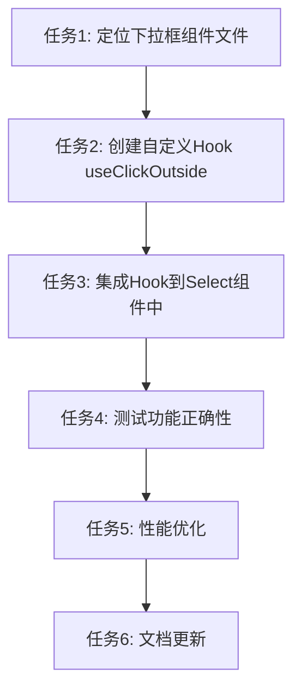

# 下拉框点击外部关闭功能任务清单

## 任务拆分

### 任务1: 定位下拉框组件文件
- **输入**: 项目代码库
- **输出**: 找到使用Select组件的关键文件
- **实现约束**: 搜索项目中使用semi.design Select组件的地方
- **验收标准**: 列出所有包含下拉框的组件文件

### 任务2: 创建自定义Hook useClickOutside
- **输入**: React Hooks API
- **输出**: useClickOutside.ts 文件
- **实现约束**: 
  - 使用TypeScript
  - 遵循React Hooks最佳实践
  - 包含适当的类型定义
- **验收标准**: Hook能够正确检测外部点击并执行回调函数

### 任务3: 集成Hook到Select组件中
- **输入**: 找到的Select组件文件, useClickOutside Hook
- **输出**: 集成后的组件代码
- **实现约束**: 
  - 为组件添加ref引用
  - 正确管理isOpen状态
  - 处理事件传播
- **验收标准**: 下拉框能够根据点击位置正确展开和收起

### 任务4: 测试功能正确性
- **输入**: 集成后的代码
- **输出**: 功能验证报告
- **实现约束**: 
  - 测试各种点击场景
  - 测试多个下拉框的交互
  - 确保无事件冲突
- **验收标准**: 所有测试场景通过，功能正常工作

### 任务5: 性能优化
- **输入**: 基本实现的代码
- **输出**: 优化后的代码
- **实现约束**: 
  - 避免不必要的状态更新
  - 确保事件监听器正确清理
  - 优化渲染性能
- **验收标准**: 页面性能无明显下降，内存使用正常

### 任务6: 文档更新
- **输入**: 实现的代码和功能
- **输出**: 更新的文档
- **实现约束**: 
  - 添加技术实现说明
  - 添加使用示例
  - 更新组件API文档
- **验收标准**: 文档完整清晰，包含必要的使用说明

## 任务依赖关系

## 风险评估

| 风险项 | 可能性 | 影响 | 缓解措施 |
|-------|-------|------|--------|
| 事件监听器冲突 | 中 | 可能导致其他交互失效 | 确保正确处理事件传播，避免阻止必要的默认行为 |
| 内存泄漏 | 中 | 长时间使用后性能下降 | 在组件卸载时正确清理事件监听器 |
| 第三方库兼容性 | 低 | 可能与semi.design内部实现冲突 | 检查semi.design文档，了解其现有功能 |
| 边界情况未覆盖 | 中 | 特定场景下功能失效 | 全面测试各种使用场景，包括快速点击、多个下拉框等 |