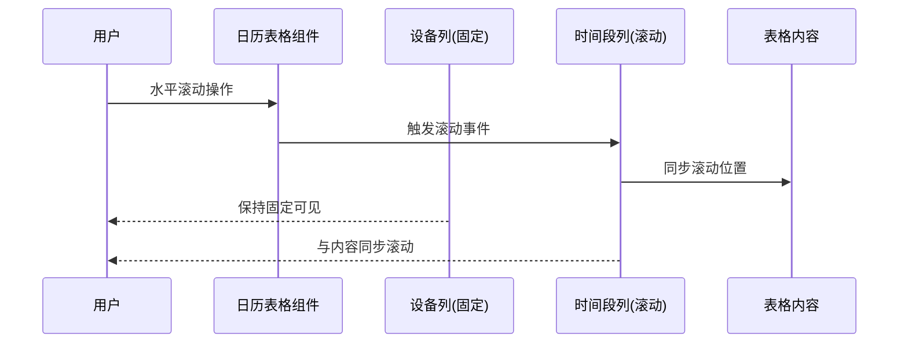
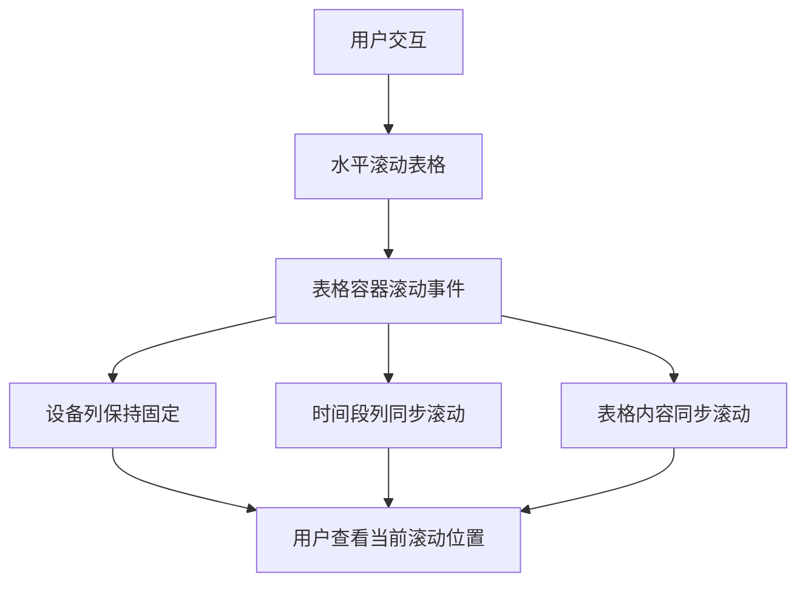

# div 列表时间轴滚动同步 - 设计文档

## 架构流程图



## 模块划分

### 1. 表格组件模块
- **文件**: `src/components/CalendarView.tsx`
- **主要组件**: Semi UI的`Table`组件
- **职责**: 渲染日历表格，管理表格配置和数据

### 2. 表格列配置模块
- **文件**: `src/components/CalendarView.tsx`中的`buildColumns()`函数
- **职责**: 定义表格的列结构，包括固定列和滚动列的配置

### 3. 滚动同步机制
- **实现方式**: 通过移除时间段列的`fixed: "left"`属性实现自然滚动同步
- **职责**: 确保时间轴头部与内容区域在水平滚动时保持同步

## 数据流



## 错误处理机制

1. **滚动不同步问题**:
   - 确保所有时间段列的`fixed`属性都被正确移除
   - 验证`scroll={{ x: 'max-content' }}`配置正确应用

2. **样式兼容性问题**:
   - 检查滚动同步后是否有视觉错位或样式问题
   - 必要时调整表格列宽度或样式以保持布局一致性

## 代码实现方案

### 修改表格列配置

在`buildColumns()`函数中，我们需要：
1. 保留设备列的`fixed: "left"`属性
2. 移除所有时间段列的`fixed: "left"`属性

```typescript
// 修改前
timeSlots.forEach(slot => {
  columns.push({
    key: slot.startTime,
    title: slot.startTime,
    dataIndex: `time_${slot.startTime}`,
    width: 120,
    fixed: "left",  // 问题根源：时间段列也被固定
    className: "time-slot-column"
  });
});

// 修改后
timeSlots.forEach(slot => {
  columns.push({
    key: slot.startTime,
    title: slot.startTime,
    dataIndex: `time_${slot.startTime}`,
    width: 120,
    // 移除fixed属性，允许时间段列随内容滚动
    className: "time-slot-column"
  });
});
```

### 验证方法

1. **手动测试**:
   - 打开应用，导航到设备预约页面
   - 水平滚动表格，确认时间段列与内容区域同步滚动
   - 确认设备列保持固定

2. **功能验证**:
   - 测试单元格点击功能是否正常
   - 验证悬浮效果是否正常工作
   - 检查表格在不同宽度下的滚动行为