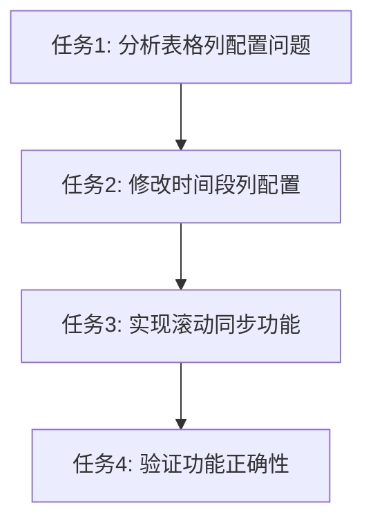

# div 列表时间轴滚动同步 - 任务拆分文档

## 任务清单

### 任务1: 分析表格列配置问题
**输入**: CalendarView组件代码
**输出**: 确认时间段列的fixed属性问题
**验收标准**: 识别出所有需要修改的时间段列配置
**实现约束**: 仅分析CalendarView.tsx中的buildColumns函数

### 任务2: 修改时间段列配置
**输入**: CalendarView组件代码
**输出**: 修改后的buildColumns函数代码
**验收标准**: 移除所有时间段列的fixed: "left"属性
**实现约束**: 保留设备列的fixed: "left"属性，不改变其他配置

### 任务3: 实现滚动同步功能
**输入**: 修改后的CalendarView组件
**输出**: 具备滚动同步功能的表格
**验收标准**: 时间段列能与内容区域同步水平滚动
**实现约束**: 确保设备列保持固定

### 任务4: 验证功能正确性
**输入**: 实现后的代码
**输出**: 功能验证报告
**验收标准**: 
- 时间段列与内容区域同步滚动
- 设备列保持固定
- 现有功能（点击、悬浮等）正常工作
**实现约束**: 手动测试所有功能点

## 任务依赖关系

### 依赖说明
- 任务1是任务2的前置条件，需要先分析问题才能进行修改
- 任务2是任务3的基础，修改配置是实现滚动同步的关键
- 任务3完成后才能进行任务4的功能验证