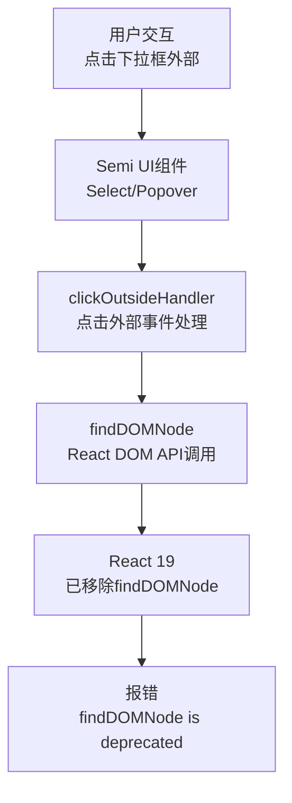
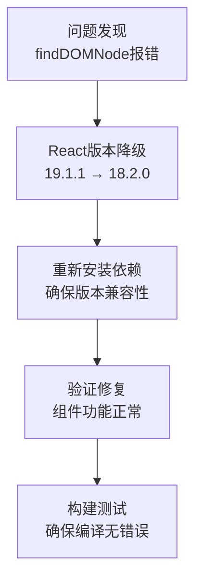

# 架构设计：div按钮失焦报错修复

## 问题根源分析

### 架构图

### 问题说明
1. Semi UI组件（如Select、Popover）内部使用了`findDOMNode` API来实现点击外部关闭功能
2. React 19版本完全移除了`findDOMNode`方法，导致这些组件无法正常工作
3. 错误主要发生在`clickOutsideHandler`函数中，当用户点击下拉框外部时触发

## 解决方案架构

### 架构图

### 技术选择理由
1. **React 18.2.0**：与Semi UI 2.27.0完全兼容，保留了`findDOMNode` API（但会在严格模式下发出警告）
2. **最小侵入性**：不需要修改组件代码，只需要调整依赖版本
3. **稳定性**：React 18.2.0是一个稳定的LTS版本，广泛使用且支持良好

## 实现步骤

1. **修改package.json**
   - 将react和react-dom版本从19.1.1降级到18.2.0
   - 同步更新@types/react和@types/react-dom版本

2. **依赖管理**
   - 删除node_modules目录
   - 使用npm install --legacy-peer-deps重新安装依赖

3. **验证流程**
   - 启动开发服务器
   - 测试Select组件点击外部关闭功能
   - 检查控制台是否还有错误
   - 运行构建命令验证编译是否成功

## 错误处理
- 如遇依赖冲突，使用`--legacy-peer-deps`选项
- 如遇编译错误，检查TypeScript类型定义是否与React 18兼容

## 后续优化方向
- 关注Semi UI官方对React 19的兼容性更新
- 长期计划升级到完全支持React 19的UI组件库版本