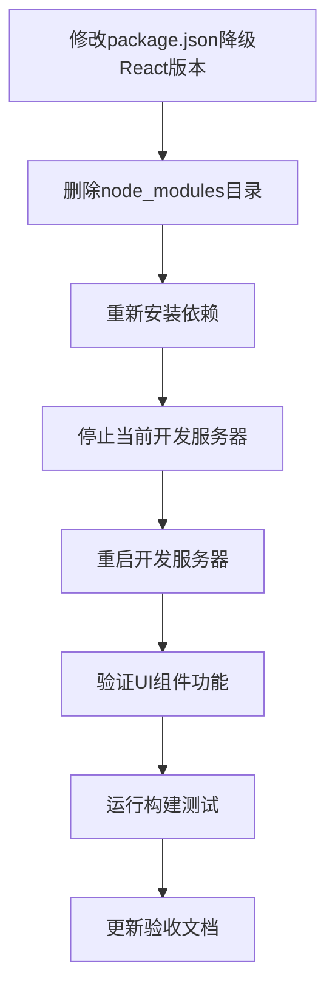

# 任务拆分：div按钮失焦报错修复

## 任务依赖图

## 任务清单

### T1: 修改package.json降级React版本
- **输入**: 现有的package.json文件
- **输出**: 更新后的package.json文件（React版本降级到18.2.0）
- **实现约束**:
  - 将react和react-dom版本从^19.1.1改为^18.2.0
  - 将@types/react和@types/react-dom版本从^19.2.2改为^18.2.0
- **验收标准**: package.json文件成功更新，版本号正确

### T2: 删除node_modules目录
- **输入**: 无
- **输出**: node_modules目录被删除
- **实现约束**: 使用PowerShell命令Remove-Item
- **验收标准**: node_modules目录不存在

### T3: 重新安装依赖
- **输入**: 更新后的package.json
- **输出**: 重新安装的node_modules目录
- **实现约束**: 使用npm install --legacy-peer-deps命令
- **验收标准**: 依赖安装成功，无错误

### T4: 停止当前开发服务器
- **输入**: 运行中的开发服务器命令ID
- **输出**: 开发服务器停止
- **实现约束**: 使用stop_command工具
- **验收标准**: 开发服务器进程终止

### T5: 重启开发服务器
- **输入**: 无
- **输出**: 新的开发服务器实例
- **实现约束**: 使用npm run dev命令
- **验收标准**: 开发服务器成功启动，无错误

### T6: 验证UI组件功能
- **输入**: 运行中的应用
- **输出**: 功能验证结果
- **实现约束**: 
  - 测试Select组件点击外部关闭功能
  - 检查控制台是否还有findDOMNode错误
- **验收标准**: 
  - Select组件能正常关闭
  - 控制台无findDOMNode相关错误

### T7: 运行构建测试
- **输入**: 项目代码
- **输出**: 构建结果
- **实现约束**: 使用npm run build命令
- **验收标准**: 构建成功，无编译错误

### T8: 更新验收文档
- **输入**: 测试结果
- **输出**: 更新的ACCEPTANCE文档
- **实现约束**: 记录修复过程和验证结果
- **验收标准**: 验收文档完整记录修复情况