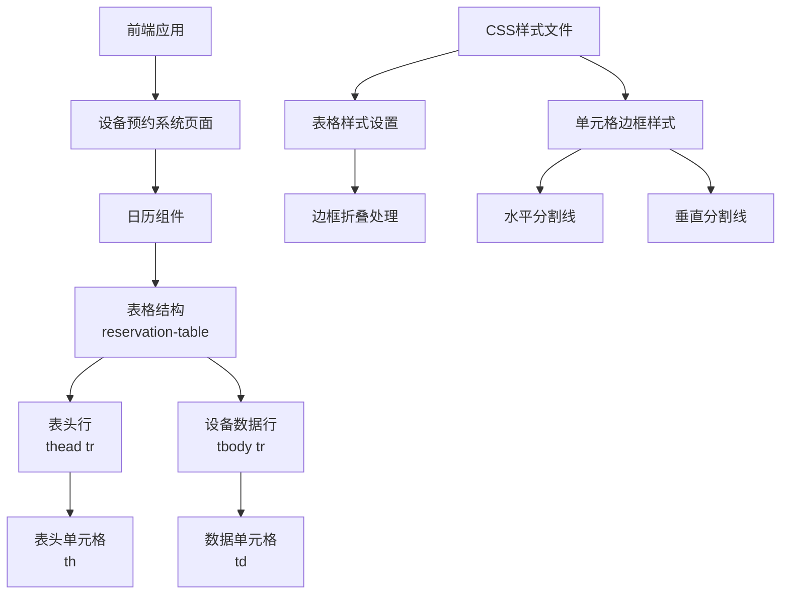

# 架构设计：div日历添加横纵分割线

## 架构图

## 模块划分和依赖关系

### 核心模块
1. **日历表格组件**
   - 负责渲染设备预约日历视图
   - 包含表头（时间列）和表体（设备行和预约信息）
   - 依赖表格样式定义

2. **CSS样式定义**
   - 为日历表格提供视觉呈现
   - 定义表格布局和单元格样式
   - 需要扩展以包含分割线样式

### 依赖关系
- 页面组件依赖日历组件
- 日历组件依赖表格DOM结构
- 表格DOM结构依赖CSS样式渲染

## 接口定义和数据流

### 数据流向
1. 后端提供设备和预约数据
2. 前端获取数据并传递给日历组件
3. 日历组件将数据渲染为表格结构
4. CSS样式应用于表格，包括新增的分割线样式

### 主要DOM元素
- `.reservation-table` - 主表格容器
- `thead th` - 表头单元格（时间列）
- `tbody td` - 数据单元格（设备行和时间段交叉点）
- `.calendar-grid` - 日历网格容器

## 错误处理机制

### 潜在问题和解决方案
1. **边框重叠问题**
   - 使用`border-collapse: collapse`确保边框合并
   - 或使用单边边框避免重叠

2. **样式冲突**
   - 使用更具体的CSS选择器确保样式优先级
   - 避免修改全局表格样式，专注于日历组件的表格样式

3. **响应式适配**
   - 确保添加分割线后表格仍能在不同屏幕尺寸下正常显示
   - 考虑在小屏幕设备上优化分割线显示