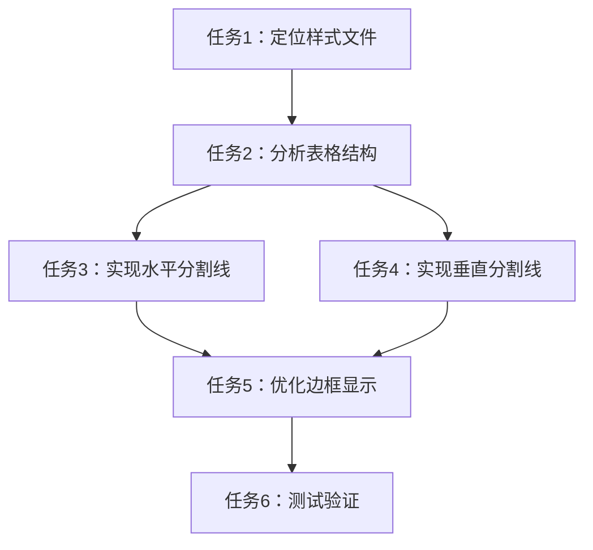

# 任务拆分：div日历添加横纵分割线

## 任务清单

### 任务1：定位日历表格组件的样式文件
- **输入**：前端项目结构
- **输出**：确认日历表格组件使用的CSS文件路径
- **实现约束**：
  - 检查前端项目的样式文件结构
  - 找到与日历或预约相关的CSS定义
- **依赖关系**：无

### 任务2：分析当前表格样式和DOM结构
- **输入**：日历组件的HTML结构和现有样式
- **输出**：理解当前表格布局和样式实现方式
- **实现约束**：
  - 检查表格的class名称和结构
  - 分析现有样式定义，特别是与表格相关的样式
- **依赖关系**：依赖任务1完成

### 任务3：实现表格水平分割线样式
- **输入**：表格DOM结构和现有样式
- **输出**：添加行之间的水平分割线
- **实现约束**：
  - 为表格行或单元格添加底边框
  - 确保水平分割线样式与UI一致
- **依赖关系**：依赖任务2完成

### 任务4：实现表格垂直分割线样式
- **输入**：表格DOM结构和现有样式
- **输出**：添加列之间的垂直分割线
- **实现约束**：
  - 为表格单元格添加右边框
  - 确保垂直分割线样式与UI一致
- **依赖关系**：依赖任务2完成

### 任务5：优化表格边框显示，避免重叠
- **输入**：已添加分割线的表格样式
- **输出**：修复可能的边框重叠问题
- **实现约束**：
  - 使用border-collapse或单边边框策略
  - 确保分割线清晰可见
- **依赖关系**：依赖任务3和任务4完成

### 任务6：测试和验证分割线效果
- **输入**：修改后的样式
- **输出**：确认分割线在各种场景下正常显示
- **实现约束**：
  - 验证在不同设备和预约状态下的显示效果
  - 确保不影响现有功能
- **依赖关系**：依赖任务5完成

## 任务依赖图

