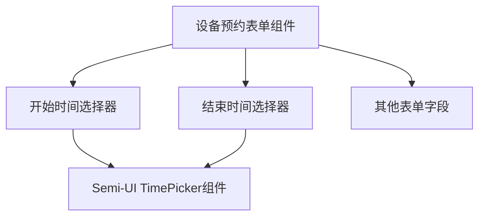

# 设计文档：设备预约表单时间选择器优化

## 架构图

## 模块划分和依赖关系
1. **设备预约表单组件**：主容器组件，包含所有表单字段
2. **时间选择器组件**：使用 Semi-UI 的 TimePicker 组件替代现有的 DatePicker
3. **状态管理**：表单数据管理，包括时间值的存储和验证

## 接口定义和数据流

### 数据输入
- 时间选择：用户通过时间选择器选择开始时间和结束时间
- 格式要求：HH:mm 格式

### 数据输出
- 表单提交时，时间值以 HH:mm 格式传递给后端
- 保留现有的表单提交接口不变

## 修改方案

### 1. 组件替换
根据 Semi-UI 文档，需要修改现有的 DatePicker 配置或替换为专门的 TimePicker 组件。

### 2. 配置修改
- 如果使用 DatePicker，需要设置 `format="HH:mm"` 和相应的模式配置
- 如果使用 TimePicker，需要确保正确导入并配置

### 3. 样式调整
- 确保时间选择器与表单其他部分风格一致
- 调整可能的布局变化

## 错误处理机制
1. 保留现有的表单验证逻辑
2. 确保时间选择器的值变更不会破坏表单验证
3. 添加适当的错误提示