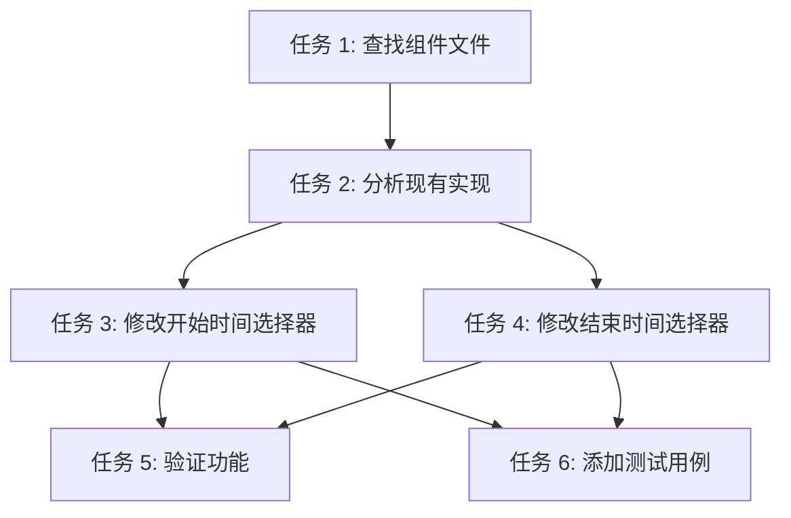

# 任务拆分文档：设备预约表单时间选择器优化

## 任务列表

### 任务 1：查找设备预约表单组件文件
- **输入**：项目代码库
- **输出**：定位到包含时间选择器的表单组件文件
- **实现约束**：使用搜索工具查找相关组件
- **依赖关系**：无

### 任务 2：分析现有时间选择器实现
- **输入**：表单组件文件内容
- **输出**：理解当前 DatePicker 组件的配置和使用方式
- **实现约束**：检查导入、配置和事件处理
- **依赖关系**：任务 1 完成

### 任务 3：修改开始时间选择器
- **输入**：分析结果
- **输出**：将开始时间选择器修改为纯时间模式
- **实现约束**：使用 Semi-UI 组件，保持 HH:mm 格式
- **依赖关系**：任务 2 完成

### 任务 4：修改结束时间选择器
- **输入**：分析结果
- **输出**：将结束时间选择器修改为纯时间模式
- **实现约束**：使用 Semi-UI 组件，保持 HH:mm 格式
- **依赖关系**：任务 2 完成

### 任务 5：验证表单功能正常
- **输入**：修改后的代码
- **输出**：确认表单可以正常提交，时间值正确保存
- **实现约束**：手动测试和自动化测试结合
- **依赖关系**：任务 3、4 完成

### 任务 6：添加或更新测试用例
- **输入**：修改后的组件
- **输出**：针对时间选择器修改的测试用例
- **实现约束**：遵循项目测试规范
- **依赖关系**：任务 3、4 完成

## 任务依赖图
