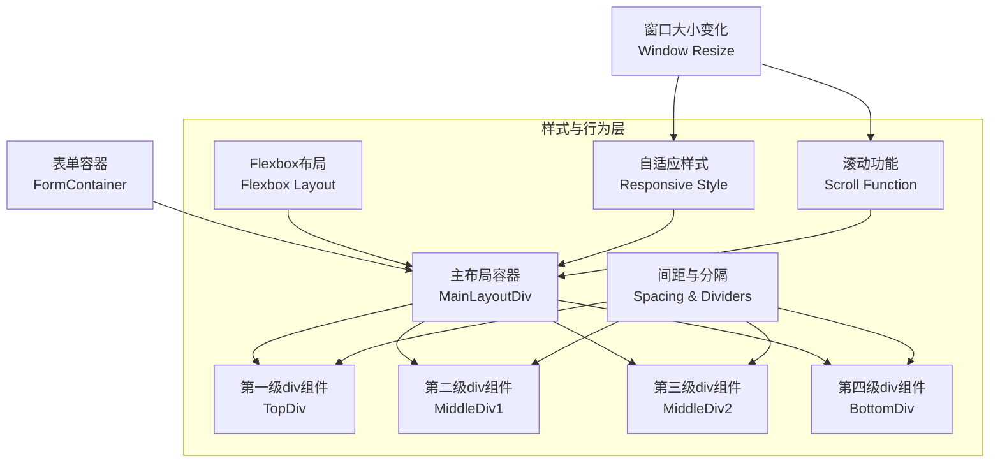

# 架构设计：div组件在表单中使用上下排序的结构，且做自适应，可根据窗口大小加上滚动条

## 架构图



## 模块划分和依赖关系

### 核心模块

1. **表单容器模块**
   - 功能：作为整个表单的最外层容器
   - 依赖：无
   - 关键属性：设置最大宽度、居中显示、背景色等基础样式

2. **主布局容器模块**
   - 功能：实现上下排序的Flexbox布局
   - 依赖：表单容器模块
   - 关键属性：display: flex, flex-direction: column, 溢出处理

3. **div组件模块**（多个）
   - 功能：容纳表单各部分内容
   - 依赖：主布局容器模块
   - 关键属性：flex属性、padding、margin、背景色等

4. **自适应控制模块**
   - 功能：根据窗口大小调整布局
   - 依赖：主布局容器模块
   - 关键逻辑：响应式设计、媒体查询

5. **滚动控制模块**
   - 功能：控制滚动条的显示和行为
   - 依赖：主布局容器模块
   - 关键属性：overflow、max-height、height计算

### 依赖关系表

| 模块 | 依赖模块 | 关系类型 |
|------|---------|----------|
| 表单容器 | 无 | 根模块 |
| 主布局容器 | 表单容器 | 直接依赖 |
| div组件 | 主布局容器 | 直接依赖 |
| 自适应控制 | 主布局容器 | 行为依赖 |
| 滚动控制 | 主布局容器 | 行为依赖 |

## 接口定义和数据流

### 组件接口

```typescript
interface FormContainerProps {
  children: React.ReactNode;
  className?: string;
}

interface MainLayoutProps {
  children: React.ReactNode;
  className?: string;
  maxHeight?: string | number;
  minHeight?: string | number;
}

interface FormDivProps {
  children: React.ReactNode;
  className?: string;
  flex?: string | number;
}
```

### 数据流

1. **自上而下的数据流向**
   - 窗口大小变化 → 触发主布局容器重排
   - 布局容器状态变化 → 影响内部div组件的尺寸和位置
   - 滚动事件 → 控制可见区域内容

2. **自下而上的数据流向**
   - 子div组件内容变化 → 影响父容器的高度计算
   - 内容溢出事件 → 触发滚动条显示

## 错误处理机制

1. **布局错误处理**
   - 问题：子组件内容过宽导致布局破坏
   - 解决方案：设置overflow-wrap: break-word，防止内容溢出

2. **滚动条兼容性**
   - 问题：不同浏览器滚动条样式不一致
   - 解决方案：使用标准滚动条属性，避免过度自定义

3. **窗口大小极值处理**
   - 问题：极小或极大窗口尺寸下布局异常
   - 解决方案：设置min-width/min-height，添加媒体查询针对极端情况优化