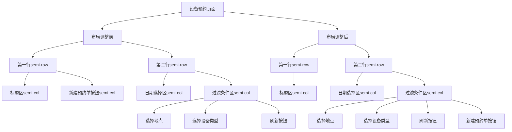

# 设计文档

## 架构图

## 模块划分和依赖关系

本次调整主要涉及设备预约页面的UI布局，不修改功能逻辑。主要模块如下：

| 模块 | 职责 | 涉及文件 | 依赖关系 |
|------|------|----------|----------|
| 设备预约页面 | 页面主体组件 | DeviceReservationPage.tsx | 依赖FilterComponent、ReservationCalendar等子组件 |
| 按钮组件 | 提供交互功能 | Semi UI Button组件 | 无修改，仅调整位置 |
| 布局组件 | 提供网格和弹性布局 | Semi UI Row/Col组件 | 调整组件嵌套关系 |

## 接口定义和数据流

本次修改不涉及API接口或数据流的变更，仅调整UI元素的排列顺序。

## 错误处理机制

由于本次修改仅涉及UI布局调整，不引入新的错误处理逻辑。我们需要确保：

1. 调整后的JSX结构仍然是有效的React组件
2. 按钮的onClick事件处理器仍然正确绑定
3. 页面加载和渲染不会因为布局调整而出现错误

## 实现细节

1. **定位需要修改的代码**：
   - 需要找到DeviceReservationPage.tsx或相关组件中的JSX结构
   - 识别包含「新建预约单」按钮和「刷新」按钮的代码块

2. **调整策略**：
   - 将「新建预约单」按钮的JSX代码从当前位置剪切
   - 将其粘贴到「刷新」按钮的JSX代码之后
   - 确保两个按钮都位于同一个容器元素内，并且使用适当的布局属性

3. **样式调整**：
   - 可能需要调整按钮之间的margin-right或gap属性
   - 确保在flex布局中按钮正确排列

4. **验证方法**：
   - 页面加载后检查按钮位置是否正确
   - 点击按钮验证功能是否正常
   - 调整浏览器窗口大小检查响应式表现