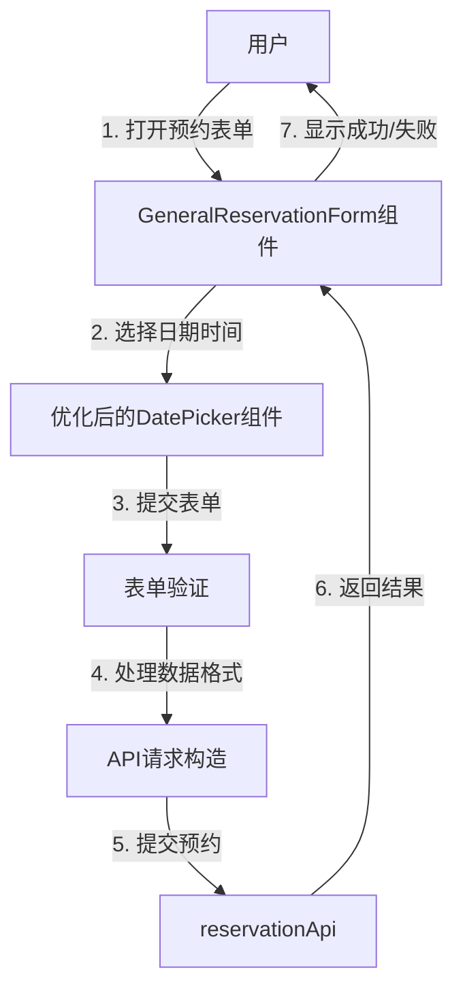

# 技术设计文档 - div预约时间优化

## 1. 架构图



## 2. 模块划分和依赖关系

| 模块 | 职责 | 依赖 |
|------|------|------|
| GeneralReservationForm | 设备预约表单组件 | @douyinfe/semi-ui, api services |
| DatePicker组件 | 日期时间选择器 | @douyinfe/semi-ui |
| 表单验证逻辑 | 验证预约信息有效性 | React hooks |
| 数据处理函数 | 处理日期时间数据转换 | React |
| reservationApi | 预约相关API调用 | 后端API |

## 3. 接口定义和数据流

### 3.1 组件接口

```typescript
interface GeneralReservationFormProps {
  visible: boolean;  // 控制表单是否显示
  onClose: () => void;  // 关闭表单回调
  onSuccess?: () => void;  // 预约成功回调
}
```

### 3.2 数据结构调整

**调整前：**
```typescript
interface FormData extends ApiReservationFormData {
  locationId?: number;
  typeId?: number;
  date: string;  // 单独的预约日期字段
}
```

**调整后：**
```typescript
interface FormData extends ApiReservationFormData {
  locationId?: number;
  typeId?: number;
  // 移除单独的date字段，startTime和endTime将包含完整日期时间
}
```

### 3.3 数据流

1. **用户选择开始/结束时间** → DatePicker组件生成Date对象
2. **handleTimeChange函数** → 将Date对象转换为ISO格式日期时间字符串
3. **表单验证** → 验证开始时间早于结束时间，且为未来时间
4. **提交预约** → 构造API请求，包含完整的日期时间信息
5. **API响应** → 处理成功/失败结果，更新界面

## 4. 错误处理机制

1. **日期时间选择错误**：
   - 开始时间晚于结束时间时显示错误提示
   - 选择过去的日期时间时显示错误提示

2. **表单验证错误**：
   - 在输入框下方显示具体错误信息
   - 提交时校验所有必填字段

3. **API请求错误**：
   - 显示通用错误提示
   - 提供重试选项

## 5. 实现细节

### 5.1 DatePicker组件配置

- 将开始时间和结束时间的DatePicker组件修改为日期时间选择模式
- 设置适当的format，如"yyyy-MM-dd HH:mm"
- 保持与现有设计风格一致

### 5.2 日期时间限制

- 禁用过去的日期时间
- 开始时间必须早于结束时间
- 可选择的时间范围与系统业务规则保持一致

### 5.3 代码修改范围

1. `GeneralReservationForm.tsx`：
   - 删除预约日期字段
   - 修改开始/结束时间DatePicker配置
   - 更新表单数据处理逻辑
   - 更新表单验证逻辑

2. 相关测试文件：
   - 更新测试用例以适应新的时间选择机制
   - 添加新的测试覆盖日期时间选择场景