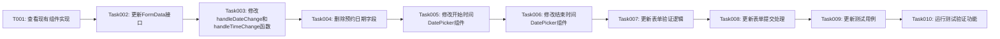

# 任务拆分文档 - div预约时间优化

## 任务依赖图

## 任务详情

### Task001: 查看现有组件实现

**输入：**
- 无

**输出：**
- 对GeneralReservationForm.tsx组件的全面理解
- 对现有DatePicker组件配置的了解
- 对表单数据处理逻辑的理解

**实现约束：**
- 熟悉Semi-UI的DatePicker组件API
- 了解React表单处理最佳实践

### Task002: 更新FormData接口

**输入：**
- Task001的结果

**输出：**
- 更新后的FormData接口，移除date字段
- 确保与ApiReservationFormData兼容

**实现约束：**
- 遵循TypeScript接口规范
- 保持与后端API的兼容性

### Task003: 修改handleDateChange和handleTimeChange函数

**输入：**
- Task002的结果

**输出：**
- 修改后的handleTimeChange函数，支持完整的日期时间处理
- 删除或整合handleDateChange函数

**实现约束：**
- 正确处理Date对象与ISO日期时间字符串的转换
- 保持函数命名规范一致性

### Task004: 删除预约日期字段

**输入：**
- Task003的结果

**输出：**
- 移除表单中的预约日期字段
- 清理相关的错误处理逻辑

**实现约束：**
- 保持界面布局的合理性
- 不影响其他表单字段的功能

### Task005: 修改开始时间DatePicker组件

**输入：**
- Task004的结果

**输出：**
- 修改后的开始时间DatePicker组件，支持日期时间选择
- 正确的format配置和disabledDate逻辑

**实现约束：**
- 使用Semi-UI的DatePicker组件
- 禁用过去的日期时间
- 保持与整体UI风格一致

### Task006: 修改结束时间DatePicker组件

**输入：**
- Task005的结果

**输出：**
- 修改后的结束时间DatePicker组件，支持日期时间选择
- 正确的format配置和与开始时间的联动

**实现约束：**
- 使用Semi-UI的DatePicker组件
- 确保结束时间晚于开始时间
- 保持与整体UI风格一致

### Task007: 更新表单验证逻辑

**输入：**
- Task006的结果

**输出：**
- 更新后的表单验证逻辑，适应新的日期时间格式
- 正确的错误提示显示

**实现约束：**
- 验证开始时间早于结束时间
- 验证日期时间为未来时间
- 保持错误提示的一致性

### Task008: 更新表单提交处理

**输入：**
- Task007的结果

**输出：**
- 更新后的表单提交逻辑，处理新的日期时间格式
- 正确构造API请求数据

**实现约束：**
- 与后端API保持兼容
- 处理成功和失败的情况

### Task009: 更新测试用例

**输入：**
- Task008的结果

**输出：**
- 更新后的测试用例，覆盖新的日期时间选择功能
- 确保所有测试用例与新实现兼容

**实现约束：**
- 遵循现有测试规范
- 覆盖关键场景

### Task010: 运行测试验证功能

**输入：**
- Task009的结果

**输出：**
- 所有测试通过的验证
- 功能正常工作的确认

**实现约束：**
- 运行组件测试和整体测试
- 确保无回归问题