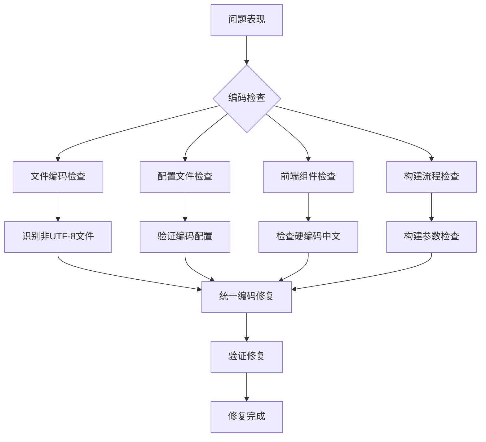
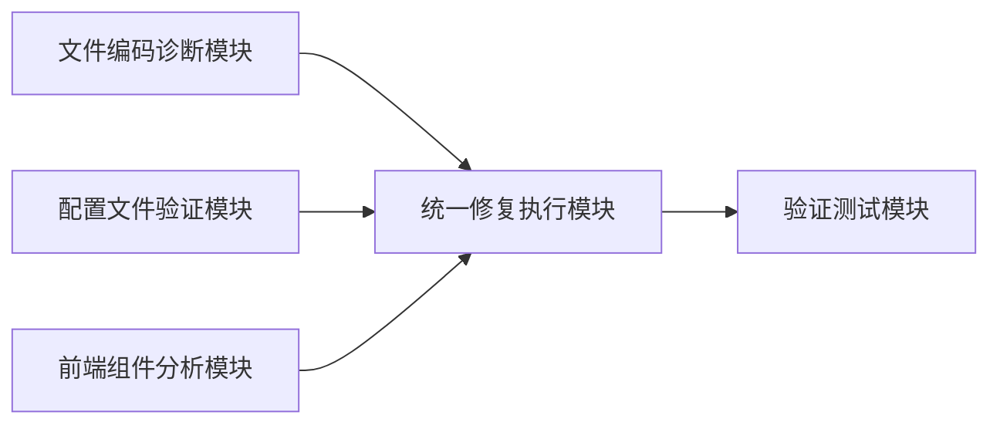
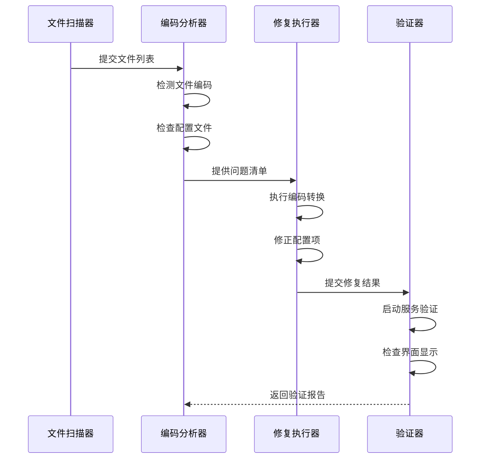

# 乱码修复任务架构设计文档

## 1. 问题分析架构

## 2. 模块划分和依赖关系

### 2.1 模块划分

1. **文件编码诊断模块**
   - 负责扫描项目文件，识别非UTF-8编码的文件
   - 检查文件BOM标记
   - 生成编码不一致报告

2. **配置文件验证模块**
   - 检查构建配置文件中的编码设置
   - 检查编辑器配置文件（如.vscode配置）
   - 检查环境变量设置

3. **前端组件分析模块**
   - 分析React组件中的中文内容
   - 检查字符串处理和国际化相关代码

4. **统一修复执行模块**
   - 执行文件编码转换
   - 修正配置文件中的编码设置
   - 修复硬编码的中文内容

5. **验证测试模块**
   - 启动前端服务验证界面显示
   - 运行构建流程验证完整性

### 2.2 依赖关系

## 3. 接口定义和数据流

### 3.1 主要接口

1. **编码检测接口**
   - 输入：文件路径
   - 输出：文件编码格式、是否存在BOM、是否有乱码特征

2. **编码转换接口**
   - 输入：文件路径、目标编码（UTF-8）
   - 输出：转换结果、是否成功

3. **配置验证接口**
   - 输入：配置文件路径
   - 输出：编码相关配置项、问题项列表

4. **构建验证接口**
   - 输入：构建命令、构建配置
   - 输出：构建日志、编码相关警告/错误

### 3.2 数据流

## 4. 错误处理机制

1. **文件访问错误**
   - 记录无法访问的文件
   - 跳过并继续处理其他文件
   - 提供错误日志

2. **编码转换失败**
   - 备份原始文件
   - 尝试替代转换方法
   - 记录详细错误信息

3. **验证不通过**
   - 提供具体问题定位
   - 允许回滚到修复前状态
   - 提供详细的调试信息

4. **修复冲突**
   - 当多个文件存在依赖关系时，采用事务式处理
   - 全部成功或全部回滚
   - 提供冲突解决建议

## 5. 性能考量

1. **并行处理**
   - 对大型项目，采用并行文件扫描
   - 避免阻塞主线程

2. **增量修复**
   - 只处理发生变化的文件
   - 维护编码状态缓存

3. **资源优化**
   - 分批处理大型文件集合
   - 避免内存溢出