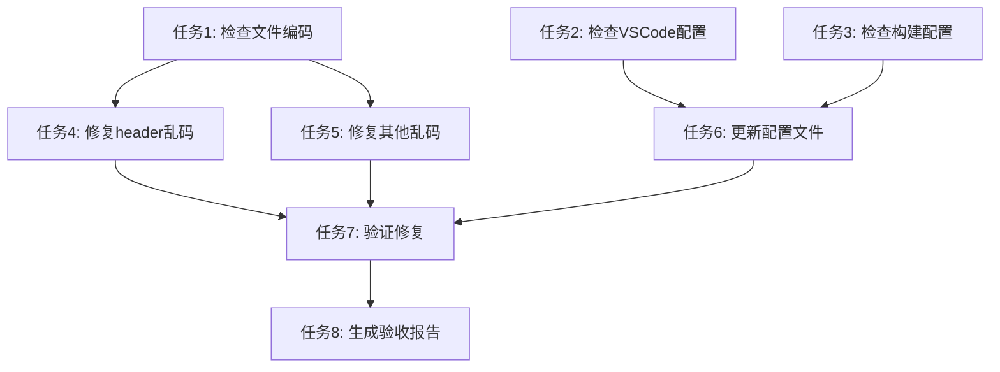

# 乱码修复任务拆分文档

## 任务分解

### 任务1: 检查前端项目文件编码格式

**输入：**
- 前端项目目录路径

**输出：**
- 文件编码检查报告
- 非UTF-8编码文件列表

**实现约束：**
- 使用PowerShell命令检查文件编码
- 重点关注.tsx、.jsx、.ts、.js、.html、.css等前端文件
- 检查是否存在BOM标记

**依赖关系：**
- 无前置依赖

### 任务2: 检查VSCode配置文件

**输入：**
- .vscode目录中的配置文件

**输出：**
- 编码相关配置检查结果
- 建议修改项

**实现约束：**
- 检查settings.json中的文件编码设置
- 确保editor.defaultEncoding设置为utf8

**依赖关系：**
- 无前置依赖

### 任务3: 检查前端构建配置文件

**输入：**
- vite.config.ts
- tsconfig.json
- package.json

**输出：**
- 构建配置编码检查结果
- 编码相关配置修正建议

**实现约束：**
- 检查TypeScript配置中的charset设置
- 检查Vite配置中的字符集处理

**依赖关系：**
- 无前置依赖

### 任务4: 修复header组件中的乱码

**输入：**
- 前端源代码文件
- 已识别的乱码组件位置

**输出：**
- 修复后的组件文件
- 验证截图（如可能）

**实现约束：**
- 使用UTF-8编码保存修改后的文件
- 确保Semi UI组件正确处理中文

**依赖关系：**
- 任务1（确认文件编码）

### 任务5: 检查并修复其他乱码问题

**输入：**
- 项目中所有文本文件
- 已识别的编码问题文件列表

**输出：**
- 统一编码后的所有文件
- 修复日志

**实现约束：**
- 将所有文件转换为UTF-8编码
- 保留文件原始内容结构

**依赖关系：**
- 任务1（确认所有文件编码）

### 任务6: 更新相关配置文件

**输入：**
- 任务2和任务3中发现的问题配置

**输出：**
- 更新后的配置文件
- 配置变更说明

**实现约束：**
- 确保所有配置文件都使用UTF-8编码
- 明确设置所有编码相关配置项

**依赖关系：**
- 任务2（VSCode配置检查）
- 任务3（构建配置检查）

### 任务7: 重新启动前端服务验证修复

**输入：**
- 修复后的项目文件
- 已更新的配置

**输出：**
- 服务启动日志
- 界面显示验证结果

**实现约束：**
- 停止当前运行的前端服务
- 使用npm run dev重新启动服务
- 检查界面是否正常显示（无乱码）

**依赖关系：**
- 任务4（修复header乱码）
- 任务5（修复其他乱码）
- 任务6（更新配置文件）

### 任务8: 生成验收报告

**输入：**
- 所有修复操作记录
- 验证结果

**输出：**
- ACCEPTANCE文档
- 最终修复总结

**实现约束：**
- 详细记录所有修改的文件
- 提供修复前后的对比
- 确认所有验收标准是否满足

**依赖关系：**
- 任务7（验证修复）

## 任务依赖关系图

## 执行顺序建议

1. 任务1: 检查前端项目文件编码格式
2. 任务2: 检查VSCode配置文件
3. 任务3: 检查前端构建配置文件
4. 任务4: 修复header组件中的乱码
5. 任务5: 检查并修复其他乱码问题
6. 任务6: 更新相关配置文件
7. 任务7: 重新启动前端服务验证修复
8. 任务8: 生成验收报告