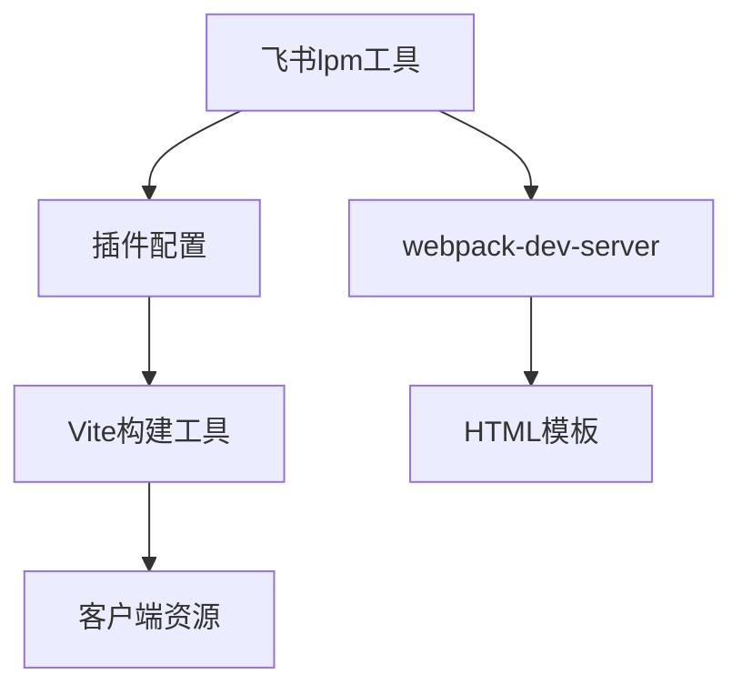

# 架构设计文档：lpm start与Vite兼容性问题

## 架构概述

本项目是一个使用Vite构建的飞书插件。当前遇到的问题是飞书的lpm工具默认使用webpack-dev-server启动开发服务器，而我们的项目使用Vite，导致资源加载路径不匹配。

```mermaid
flowchart TD
    A[lpm start] --> B[webpack-dev-server:3339]
    C[浏览器请求] --> B
    B --> D[尝试加载/@vite/client]
    D --> E[404错误]
    
    F[预期架构] --> G[lpm识别Vite项目]
    G --> H[正确处理资源路径]
    H --> I[正常加载页面]
```

## 模块划分和依赖关系



## 配置方案

### 方案1：配置lpm使用项目的Vite服务

1. 修改plugin.config.json，添加构建工具配置
2. 配置lpm代理到项目的Vite开发服务器

### 方案2：修改项目适配webpack-dev-server

1. 创建webpack配置文件
2. 调整入口文件和资源引用路径

### 方案3：使用lpm的自定义命令功能

1. 配置lpm使用项目自带的npm run dev命令
2. 确保lpm能够正确处理代理和资源路径

## 错误处理机制

1. 404资源处理：确保所有资源路径在不同构建工具间兼容
2. 端口冲突处理：避免lpm和Vite使用冲突的端口
3. 构建工具检测：添加机制检测项目使用的构建工具类型

## 测试策略

1. 使用lpm start启动服务
2. 访问服务地址验证页面加载
3. 检查控制台是否有错误
4. 验证核心功能是否正常工作