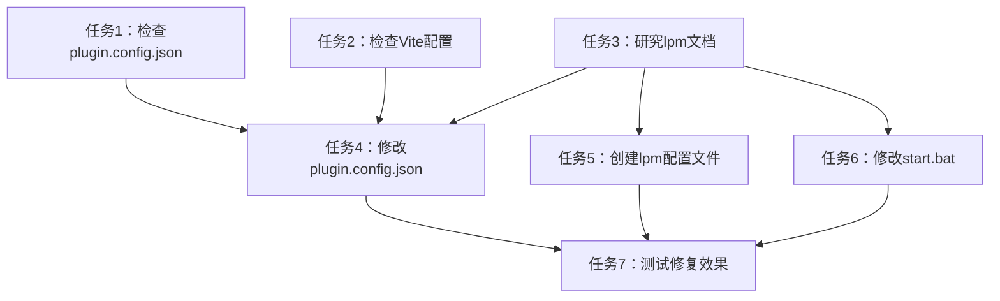

# 任务拆分文档：lpm start与Vite兼容性问题

## 任务列表

### 任务1：检查plugin.config.json配置
**输入**：现有plugin.config.json文件
**输出**：了解当前配置并确定是否需要修改
**验收标准**：确认plugin.config.json中的配置项，特别是与构建工具相关的设置
**依赖关系**：无

### 任务2：检查项目中的Vite配置
**输入**：vite.config.ts文件
**输出**：了解Vite配置和输出设置
**验收标准**：确认Vite配置中与构建输出相关的设置
**依赖关系**：无

### 任务3：研究lpm工具文档
**输入**：lpm命令帮助信息
**输出**：了解lpm支持的配置选项
**验收标准**：找到lpm关于构建工具选择的配置参数
**依赖关系**：无

### 任务4：修改plugin.config.json配置
**输入**：基于任务1-3的结果
**输出**：更新后的plugin.config.json文件
**验收标准**：配置文件包含正确的构建工具设置
**依赖关系**：任务1,2,3

### 任务5：创建或修改lpm配置文件
**输入**：基于任务3的结果
**输出**：新增或更新的lpm配置文件
**验收标准**：配置文件正确指定使用Vite作为构建工具
**依赖关系**：任务3

### 任务6：修改start.bat脚本
**输入**：现有start.bat文件
**输出**：更新后的start.bat文件
**验收标准**：脚本能够正确配置并启动lpm
**依赖关系**：任务3,4

### 任务7：测试修复效果
**输入**：修改后的配置文件
**输出**：验证报告
**验收标准**：lpm start能够成功启动服务，无404错误
**依赖关系**：任务4,5,6

## 任务依赖图

