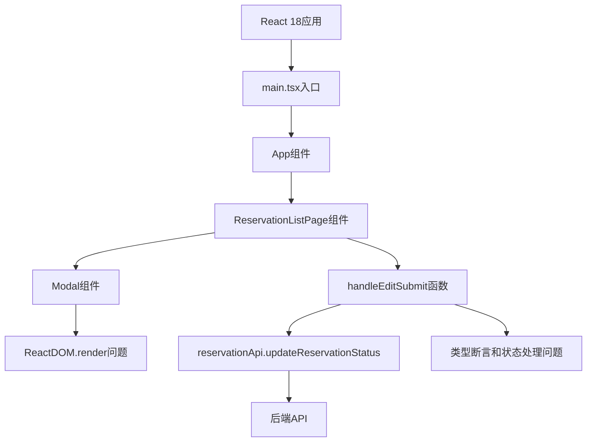
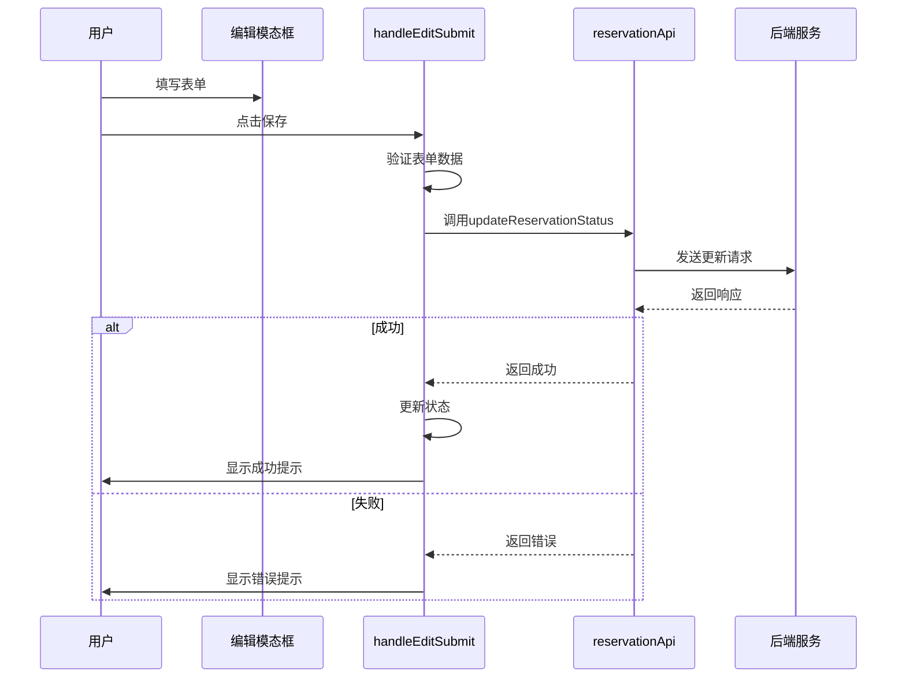

# 技术设计文档：React 18兼容性和预约单编辑修复

## 1. 架构概览

本设计方案针对设备预约系统的两个关键问题提供技术解决方案：React 18兼容性问题和编辑预约单保存失败问题。

### 系统架构图



## 2. 问题分析

### 2.1 React 18兼容性问题

虽然main.tsx已经正确使用了createRoot API，但错误日志显示仍然存在ReactDOM.render警告。通过堆栈跟踪分析，问题出现在以下路径：

```
at create (http://localhost:5173/node_modules/.vite/deps/@douyinfe_semi-ui.js?v=b8877cb7:120266:35)
at error (http://localhost:5173/node_modules/.vite/deps/@douyinfe_semi-ui.js?v=b8877cb7:120340:18)
at handleEditSubmit (http://localhost:5173/src/pages/ReservationListPage.tsx?t=1764583185945:120:14)
```

这表明问题可能与SemiUI组件在React 18环境下的内部渲染机制有关，特别是在事件处理过程中。

### 2.2 编辑预约单保存失败问题

分析handleEditSubmit函数发现以下问题：

1. 使用了不安全的类型断言：`(editFormData as any).status`
2. 状态值处理逻辑不够严谨
3. 错误处理可能不够完善
4. Modal组件的事件处理与React 18可能存在兼容性问题

## 3. 详细设计

### 3.1 React 18兼容性修复设计

#### 主要修改点：

1. **优化Modal组件配置**：
   - 确保Modal组件的getContainer属性正确配置
   - 优化Modal组件的事件绑定方式

2. **增强事件处理逻辑**：
   - 确保事件处理函数与React 18的事件系统兼容
   - 避免在事件处理中直接操作DOM

3. **改进状态更新**：
   - 使用React 18推荐的状态更新模式
   - 避免在异步操作中使用过时的状态值

### 3.2 编辑预约单功能修复设计

#### 主要修改点：

1. **重构handleEditSubmit函数**：
   - 移除不安全的类型断言
   - 使用类型守卫确保类型安全
   - 优化状态验证逻辑

2. **增强错误处理**：
   - 添加更详细的错误捕获和日志记录
   - 提供更明确的用户反馈

3. **优化数据流转**：
   - 确保表单数据与API请求数据的类型一致性
   - 添加适当的数据转换和验证

## 4. 数据流设计

### 编辑预约单数据流



## 5. 代码优化设计

### 5.1 handleEditSubmit函数优化

```typescript
const handleEditSubmit = async () => {
  if (!currentReservation) {
    Toast.error('未找到预约信息');
    return;
  }
  
  try {
    // 验证预约ID
    if (!isValidId(currentReservation.id)) {
      Toast.error('无效的预约ID');
      return;
    }
    
    // 使用类型守卫和可选链操作符安全获取状态值
    const newStatus = editFormData.status ?? currentReservation.status;
    const reason = editFormData.reason || currentReservation.reason;
    
    // 验证状态值
    if (!isValidStatus(newStatus)) {
      Toast.error('无效的预约状态');
      return;
    }
    
    // 调用API更新状态
    await reservationApi.updateReservationStatus(
      currentReservation.id, 
      newStatus, 
      reason
    );
    
    // 成功处理
    Toast.success('预约信息更新成功');
    setEditModalVisible(false);
    fetchReservations();
  } catch (err) {
    console.error('编辑预约失败:', err);
    Toast.error('预约信息更新失败，请重试');
  }
};

// 辅助函数：验证ID有效性
const isValidId = (id: unknown): id is number => {
  return typeof id === 'number' && id > 0;
};

// 辅助函数：验证状态有效性
const isValidStatus = (status: unknown): status is ReservationStatus => {
  return typeof status === 'number' && [0, 1, 2].includes(status);
};
```

### 5.2 Modal组件优化

确保Modal组件正确配置getContainer属性，并优化其事件处理：

```jsx
<Modal
  title="编辑预约"
  visible={editModalVisible}
  onOk={handleEditSubmit}
  onCancel={() => setEditModalVisible(false)}
  footer={[
    <Button key="cancel" onClick={() => setEditModalVisible(false)}>取消</Button>,
    <Button key="submit" type="primary" onClick={handleEditSubmit}>保存</Button>
  ]}
  getContainer={() => document.body} // 确保在React 18中正确渲染
  autoFocus={false} // 避免React 18中的焦点管理问题
>
  {/* 表单内容 */}
</Modal>
```

## 6. 错误处理机制

1. **客户端验证**：
   - 表单数据验证
   - 类型安全检查

2. **API错误处理**：
   - 网络错误捕获
   - 业务逻辑错误处理

3. **用户反馈**：
   - 使用Toast组件提供明确的错误信息
   - 避免在生产环境暴露详细错误堆栈

4. **日志记录**：
   - 记录关键操作和错误信息
   - 便于调试和问题追踪

## 7. 性能考虑

1. **避免不必要的渲染**：
   - 优化状态更新逻辑
   - 避免在事件处理中进行复杂计算

2. **异步操作优化**：
   - 使用async/await确保异步操作正确处理
   - 添加适当的加载状态提示

3. **内存管理**：
   - 避免内存泄漏
   - 确保组件卸载时清理相关资源

## 8. 兼容性考虑

1. **React 18适配**：
   - 使用新的并发模式API
   - 避免使用已废弃的生命周期方法

2. **浏览器兼容性**：
   - 确保所有代码在现代浏览器中正常工作
   - 避免使用过于前沿的JavaScript特性

3. **第三方库兼容**：
   - 确保SemiUI组件与React 18兼容
   - 处理可能的版本冲突