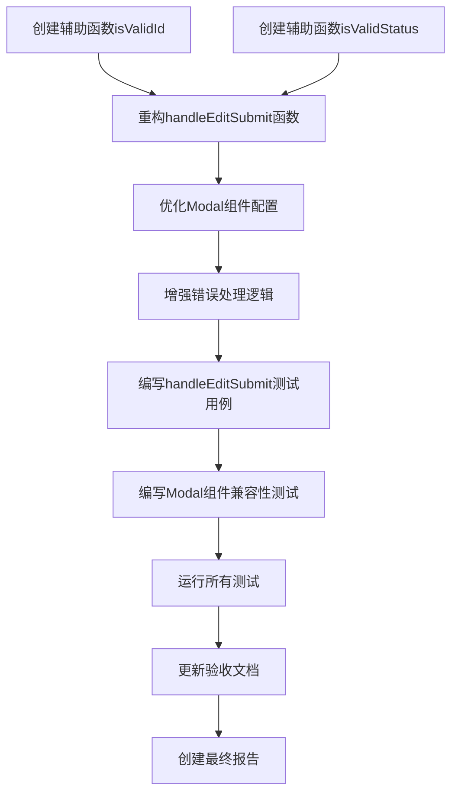

# 任务拆分文档：React 18兼容性和预约单编辑修复

## 1. 任务总览

本任务清单详细描述了修复React 18兼容性问题和编辑预约单保存失败问题的所有必要步骤。任务按照依赖关系排序，确保开发过程顺畅进行。

## 2. 任务依赖图

## 3. 详细任务列表

### 任务1: 创建辅助函数isValidId

**输入**: 无
**输出**: ReservationListPage.tsx中添加isValidId辅助函数
**实现约束**:
- 使用TypeScript类型守卫
- 确保函数能正确验证ID是否为有效的正整数
- 函数签名: `const isValidId = (id: unknown): id is number => {...}`
**依赖关系**: 无，可立即开始

### 任务2: 创建辅助函数isValidStatus

**输入**: 无
**输出**: ReservationListPage.tsx中添加isValidStatus辅助函数
**实现约束**:
- 使用TypeScript类型守卫
- 确保函数能正确验证状态值是否为有效的ReservationStatus枚举值
- 函数签名: `const isValidStatus = (status: unknown): status is ReservationStatus => {...}`
**依赖关系**: 无，可立即开始

### 任务3: 重构handleEditSubmit函数

**输入**: 现有handleEditSubmit函数代码
**输出**: 优化后的handleEditSubmit函数
**实现约束**:
- 移除不安全的类型断言 `(editFormData as any).status`
- 使用创建的辅助函数进行类型验证
- 使用可选链操作符和空值合并操作符安全获取属性值
- 确保代码类型安全，通过TypeScript检查
**依赖关系**: 任务1和任务2

### 任务4: 优化Modal组件配置

**输入**: 现有Modal组件代码
**输出**: 优化后的Modal组件配置
**实现约束**:
- 确保Modal组件的getContainer属性设置为 `() => document.body`
- 添加autoFocus={false}避免React 18中的焦点管理问题
- 优化事件处理，确保与React 18兼容
**依赖关系**: 无，但建议在任务3之后执行

### 任务5: 增强错误处理逻辑

**输入**: 现有错误处理代码
**输出**: 增强的错误处理逻辑
**实现约束**:
- 添加更详细的错误日志记录
- 提供更明确的用户反馈信息
- 区分不同类型的错误（验证错误、API错误等）
**依赖关系**: 任务3

### 任务6: 编写handleEditSubmit测试用例

**输入**: 重构后的handleEditSubmit函数
**输出**: ReservationListPage.test.tsx中添加测试用例
**实现约束**:
- 测试ID验证逻辑
- 测试状态值验证逻辑
- 测试API调用成功和失败的情况
- 测试用户反馈（Toast组件调用）
**依赖关系**: 任务3

### 任务7: 编写Modal组件兼容性测试

**输入**: 优化后的Modal组件
**输出**: ReservationListPage.test.tsx中添加Modal组件测试
**实现约束**:
- 测试Modal组件在React 18环境下能正常渲染
- 测试Modal组件的事件处理能正常工作
- 验证getContainer属性正确设置
**依赖关系**: 任务4

### 任务8: 运行所有测试

**输入**: 所有修改后的代码和测试用例
**输出**: 测试结果报告
**实现约束**:
- 运行`npx jest --verbose`命令
- 确保所有测试用例通过
- 确保没有TypeScript编译错误
**依赖关系**: 任务6和任务7

### 任务9: 更新验收文档

**输入**: 测试结果和修复实现
**输出**: ACCEPTANCE_react18_fix_reservation_edit.md文档
**实现约束**:
- 记录每个任务的完成状态
- 记录修复过程中的关键发现
- 确认所有验收标准都已满足
**依赖关系**: 任务8

### 任务10: 创建最终报告

**输入**: 所有完成的任务和文档
**输出**: FINAL_react18_fix_reservation_edit.md文档
**实现约束**:
- 总结所有修复内容
- 记录遇到的挑战和解决方案
- 提供后续建议
**依赖关系**: 任务9

## 4. 实施建议

1. **顺序执行**: 严格按照任务依赖关系执行，确保前置任务完成后再开始后续任务
2. **增量提交**: 每个任务完成后进行代码提交，确保变更可追踪
3. **持续验证**: 每个修复后运行TypeScript检查，确保类型安全
4. **结对审查**: 修复完成后进行代码自查，确保质量

## 5. 验收标准对应关系

| 验收标准 | 对应任务 |
|---------|---------|
| 编辑预约单能够成功保存 | 任务3、任务5、任务6 |
| 预约单状态能够正确更新 | 任务3、任务6 |
| 操作有相应的用户提示 | 任务5、任务6 |
| 不再出现ReactDOM.render警告 | 任务4、任务7 |
| 代码通过TypeScript类型检查 | 任务3、任务8 |
| 所有测试用例通过 | 任务6、任务7、任务8 |
| 无运行时错误 | 任务5、任务8 |