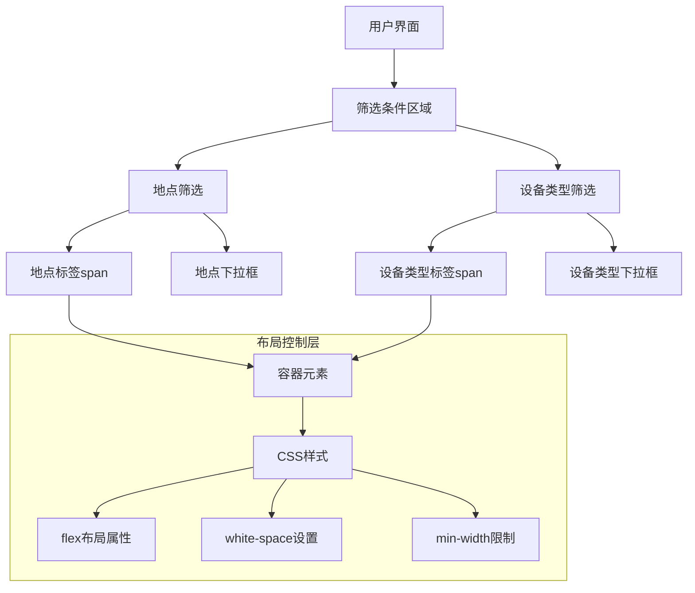

# 架构设计文档 - span横向布局

## 架构概述

本次任务主要涉及前端UI组件的布局调整，目标是确保特定的span元素在各种屏幕尺寸下保持横向显示。根据之前的分析，这些元素位于设备预约系统的筛选条件区域。

## 布局架构图

## 模块划分和依赖关系

| 模块 | 职责 | 依赖关系 | 实现方式 |
|------|------|----------|----------|
| 容器元素 | 控制内部元素的排列方式 | React组件 | 修改现有容器样式 |
| 标签span | 显示文本标签 | 无 | 添加CSS样式 |
| 输入控件 | 提供用户输入功能 | 无 | 保持现有功能 |
| CSS样式 | 控制布局行为 | 组件系统 | 内联样式或CSS类 |

## 接口定义和数据流

本次任务不涉及新的API接口或数据流修改，仅调整现有UI组件的样式属性。

## 错误处理机制

1. **样式冲突处理**：使用CSS选择器优先级确保样式正确应用
2. **响应式问题**：通过媒体查询和Flexbox布局确保在各种屏幕尺寸下的兼容性
3. **回退策略**：如果现代布局方法在某些环境下不适用，提供合理的降级方案

## 具体实现方案

### 方案1：修改容器的Flexbox属性

1. 为包含标签和输入控件的容器元素添加或修改Flexbox属性
2. 使用`align-items: center`确保标签和输入控件垂直对齐
3. 添加`flex-wrap: nowrap`确保元素不会换行

### 方案2：为span标签添加特定CSS

1. 为span标签添加`white-space: nowrap`样式，防止文本换行
2. 设置`display: inline-block`确保标签作为一个整体处理
3. 可能需要添加适当的`margin-right`以保持与输入控件的间距

### 方案3：组合使用上述方案

对于更复杂的布局情况，可能需要组合使用Flexbox容器设置和span标签特定样式，以确保在所有情况下都能正确显示。

## 实现选择

基于项目使用的semi.design组件库特性，我们将优先采用方案3，确保在各种屏幕尺寸下都能达到最佳显示效果。