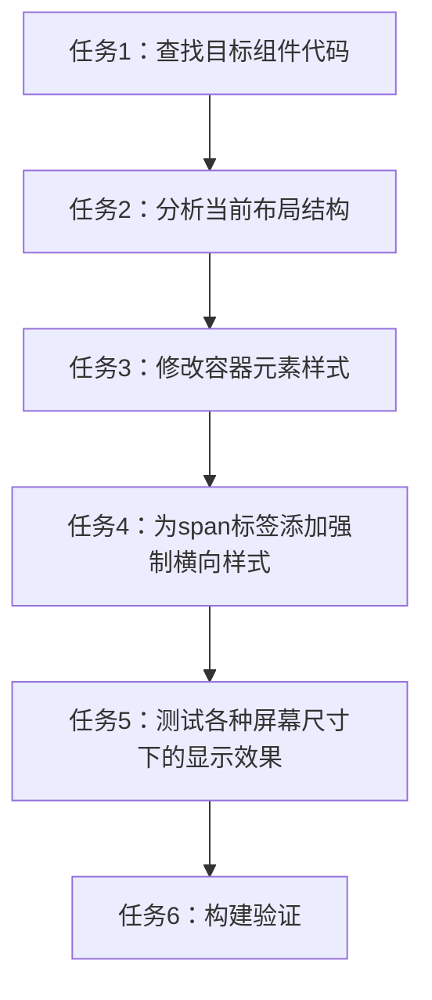

# 任务拆分文档 - span横向布局

## 任务拆分列表

### 任务1：查找目标组件代码
- **输入**：已知目标span元素的类名和文本内容
- **输出**：找到包含这些元素的组件文件位置和相关代码行
- **实现约束**：使用代码搜索工具查找相关组件
- **依赖关系**：无

### 任务2：分析当前布局结构
- **输入**：目标组件的代码
- **输出**：识别导致纵向排列的原因和相关布局容器
- **实现约束**：分析使用的CSS类、样式属性和组件结构
- **依赖关系**：任务1完成

### 任务3：修改容器元素样式
- **输入**：分析结果和需要修改的组件代码
- **输出**：更新后的容器元素代码，添加横向布局相关的Flexbox属性
- **实现约束**：使用React内联样式或semi.design提供的样式属性
- **依赖关系**：任务2完成

### 任务4：为span标签添加强制横向样式
- **输入**：修改后的组件代码
- **输出**：为span标签添加防止换行和强制横向显示的样式
- **实现约束**：确保样式选择器精确，不影响其他元素
- **依赖关系**：任务3完成

### 任务5：测试各种屏幕尺寸下的显示效果
- **输入**：修改后的代码
- **输出**：验证在不同屏幕尺寸下标签是否保持横向显示
- **实现约束**：通过浏览器开发者工具测试响应式布局
- **依赖关系**：任务4完成

### 任务6：构建验证
- **输入**：最终修改后的代码
- **输出**：确认构建是否成功，无错误或警告
- **实现约束**：运行npm run build命令验证
- **依赖关系**：任务5完成

## 任务依赖图

## 详细任务说明

### 任务1：查找目标组件代码

需要查找包含"地点:"和"设备类型:"这两个span标签的组件文件。根据之前的经验，这些元素很可能位于`ReservationCalendar.tsx`组件中。使用搜索工具查找相关代码。

### 任务2：分析当前布局结构

检查组件中的布局实现方式，特别是标签和输入控件的容器元素使用了什么布局属性。识别可能导致标签纵向排列的原因，如`flex-wrap: wrap`、缺乏明确的宽度限制或响应式设计中的媒体查询。

### 任务3：修改容器元素样式

为包含标签和输入控件的容器元素添加或修改以下样式：
- `display: 'flex'`：确保使用Flexbox布局
- `align-items: 'center'`：确保垂直对齐
- `flex-wrap: 'nowrap'`：防止元素换行
- `width: '100%'`：确保容器占据合适的宽度

### 任务4：为span标签添加强制横向样式

为标签span元素添加以下样式：
- `white-space: 'nowrap'`：防止文本内容换行
- `display: 'inline-block'`：确保标签作为一个整体处理
- `margin-right: '8px'`：保持与输入控件的适当间距

### 任务5：测试各种屏幕尺寸下的显示效果

使用浏览器开发者工具的响应式设计模式，测试在不同屏幕尺寸下（从移动设备到大屏桌面）标签的显示效果，确保它们始终保持横向排列。

### 任务6：构建验证

运行`npm run build`命令，确保修改后的代码可以成功构建，没有出现编译错误或警告。