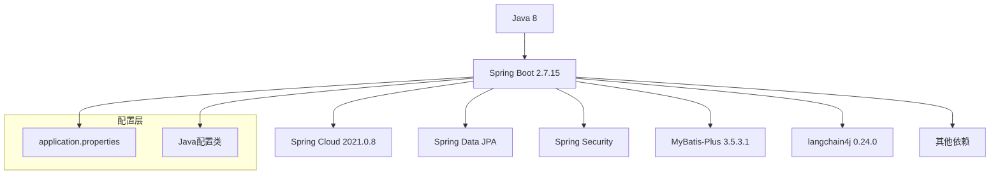
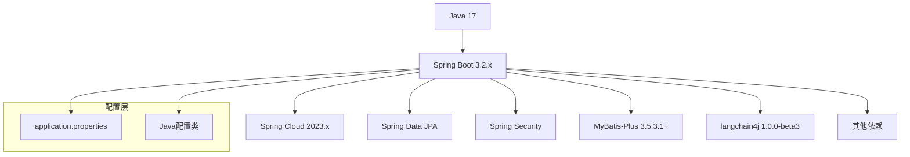

# Spring Boot 2 升级到 3 架构设计文档

## 架构概述

本次升级主要涉及项目的核心框架和关键依赖，不改变整体架构设计。以下是升级前后的架构对比：

### 升级前架构


### 升级后架构


## 模块划分和依赖关系

### 核心模块及升级影响

| 模块 | 当前版本 | 升级版本 | 影响范围 | 依赖关系 |
|------|---------|---------|---------|--------|
| Spring Boot | 2.7.15 | 3.2.x | 全局 | 所有模块的基础 |
| Java | 1.8 | 17 | 全局 | 运行环境 |
| langchain4j | 0.24.0 | 1.0.0-beta3 | AI功能模块 | 可能影响API调用方式 |
| Spring Cloud | 2021.0.8 | 2023.x | 微服务相关功能 | 需要与Spring Boot 3兼容 |
| Spring Data JPA | - | 最新 | 数据访问层 | 依赖Spring Boot版本 |
| MyBatis-Plus | 3.5.3.1 | 兼容版本 | 数据访问层 | 需检查与Spring Boot 3兼容性 |

## 接口定义和数据流

### 主要变更点

1. **包名变更**：`javax.*` 迁移到 `jakarta.*`
   - 影响所有使用Java EE API的代码，如Servlet、JPA、Validation等
   - 数据流示例：
     ```mermaid
     sequenceDiagram
         participant Client as 客户端
         participant Controller as 控制器
         participant Service as 服务层
         participant Repository as 数据访问层
         
         Client->>Controller: HTTP请求
         Controller->>Controller: 参数验证(jakarta.validation)
         Controller->>Service: 业务处理
         Service->>Repository: 数据操作(jakarta.persistence)
         Repository-->>Service: 返回数据
         Service-->>Controller: 处理结果
         Controller-->>Client: HTTP响应
     ```

2. **langchain4j API变更**：
   - 从0.24.0升级到1.0.0-beta3，API可能有重大变化
   - 调用流程示例：
     ```mermaid
     flowchart TD
         A[应用代码] --> B[langchain4j客户端]
         B --> C[OpenAI集成]
         C --> D[API调用]
         D --> E[响应处理]
     ```

## 错误处理机制

### 主要变更点

1. **异常处理**：
   - Spring Boot 3中对异常处理有一些改进
   - 需要确保自定义异常处理类与新版本兼容

2. **日志配置**：
   - 可能需要调整日志配置以适应Spring Boot 3的日志系统
   - 确保错误日志格式一致且包含必要信息

## 迁移策略

### 分步迁移计划

1. **准备阶段**：
   - 确认Java 17环境配置正确
   - 更新Maven配置，设置Java 17编译级别

2. **依赖升级阶段**：
   - 升级Spring Boot父项目版本
   - 更新langchain4j依赖版本
   - 更新其他相关Spring依赖

3. **代码调整阶段**：
   - 批量修改包名从javax.*到jakarta.*
   - 处理废弃API
   - 更新配置类和组件

4. **测试验证阶段**：
   - 编译验证
   - 单元测试和集成测试
   - 功能验证

### 关键风险点及解决方案

| 风险点 | 解决方案 |
|-------|--------|
| 包名变更影响范围广 | 使用IDE的查找替换功能批量修改，分模块进行 |
| langchain4j API变更 | 查阅官方迁移文档，修改API调用方式 |
| 依赖冲突 | 使用Maven Dependency Plugin分析并排除冲突 |
| 配置不兼容 | 查阅Spring Boot 3文档，更新配置项 |

## 性能和资源考量

1. **内存使用**：Spring Boot 3在Java 17上可能有不同的内存需求，需要调整JVM参数
2. **启动时间**：监控并对比升级前后的应用启动时间
3. **运行性能**：确保关键操作的性能不受影响