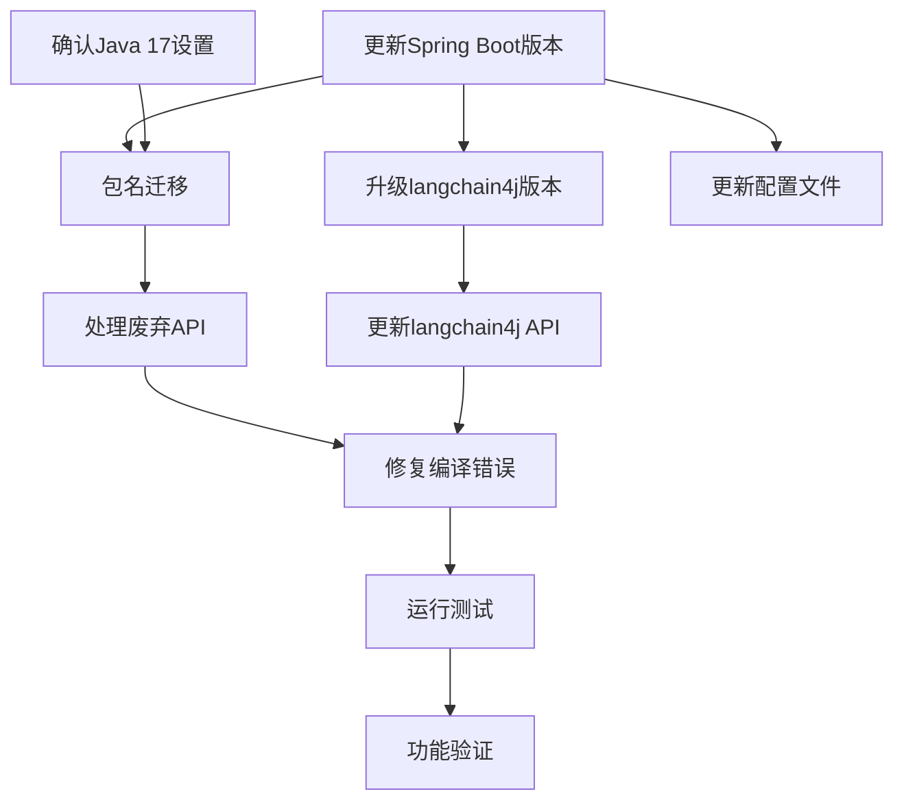

# Spring Boot 2 升级到 3 任务拆分文档

## 任务拆分清单

### 1. 更新Maven配置 - 升级Spring Boot版本
**ID**: TASK-001
**优先级**: 高
**输入**: 现有的pom.xml文件
**输出**: 更新后的pom.xml文件，Spring Boot版本升级到3.2.x
**实现约束**:
- 必须使用与Java 17兼容的Spring Boot 3.x版本
- 保持其他依赖的兼容性
**依赖关系**: 无

### 2. 更新Maven配置 - 升级langchain4j版本
**ID**: TASK-002
**优先级**: 高
**输入**: 现有的pom.xml文件
**输出**: 更新后的pom.xml文件，langchain4j版本升级到1.0.0-beta3
**实现约束**:
- 确保升级后的版本与Spring Boot 3兼容
**依赖关系**: TASK-001

### 3. 更新Java配置 - 确认Java 17设置
**ID**: TASK-003
**优先级**: 高
**输入**: 现有的Java环境配置
**输出**: 确认Java 17环境已正确配置
**实现约束**:
- 验证JAVA_HOME设置正确
- 验证Maven编译配置正确
**依赖关系**: 无

### 4. 包名迁移 - javax.* 到 jakarta.*
**ID**: TASK-004
**优先级**: 高
**输入**: 所有源代码文件
**输出**: 更新后的源代码，javax.*包已替换为jakarta.*
**实现约束**:
- 包括但不限于：javax.servlet, javax.persistence, javax.validation等
- 使用IDE批量替换功能
**依赖关系**: TASK-001, TASK-003

### 5. 处理Spring Boot 3废弃API
**ID**: TASK-005
**优先级**: 高
**输入**: 使用废弃API的源代码
**输出**: 更新后的源代码，使用新API替代废弃API
**实现约束**:
- 查阅Spring Boot 3迁移指南
- 针对每个废弃API提供替代方案
**依赖关系**: TASK-004

### 6. 更新配置文件
**ID**: TASK-006
**优先级**: 中
**输入**: 现有的application.properties/yml文件
**输出**: 更新后的配置文件，适应Spring Boot 3要求
**实现约束**:
- 更新任何重命名或移除的配置项
- 确保配置格式符合Spring Boot 3规范
**依赖关系**: TASK-001

### 7. 更新langchain4j API调用
**ID**: TASK-007
**优先级**: 高
**输入**: 使用langchain4j的源代码
**输出**: 更新后的源代码，使用langchain4j 1.0.0-beta3 API
**实现约束**:
- 查阅langchain4j 1.0.0-beta3文档
- 更新所有API调用以适应新版本
**依赖关系**: TASK-002

### 8. 修复编译错误
**ID**: TASK-008
**优先级**: 高
**输入**: 存在编译错误的源代码
**输出**: 编译通过的源代码
**实现约束**:
- 系统地解决每个编译错误
- 记录所有修复内容
**依赖关系**: TASK-004, TASK-005, TASK-007

### 9. 运行单元测试和集成测试
**ID**: TASK-009
**优先级**: 高
**输入**: 测试代码和更新后的应用代码
**输出**: 测试结果报告
**实现约束**:
- 确保所有测试通过
- 修复测试中发现的问题
**依赖关系**: TASK-008

### 10. 功能验证测试
**ID**: TASK-010
**优先级**: 中
**输入**: 构建好的应用
**输出**: 功能验证报告
**实现约束**:
- 测试关键业务功能
- 特别关注langchain4j相关功能
**依赖关系**: TASK-009

## 任务依赖关系图

## 执行顺序

1. TASK-001: 更新Maven配置 - 升级Spring Boot版本
2. TASK-003: 更新Java配置 - 确认Java 17设置
3. TASK-002: 更新Maven配置 - 升级langchain4j版本
4. TASK-004: 包名迁移 - javax.* 到 jakarta.*
5. TASK-006: 更新配置文件
6. TASK-005: 处理Spring Boot 3废弃API
7. TASK-007: 更新langchain4j API调用
8. TASK-008: 修复编译错误
9. TASK-009: 运行单元测试和集成测试
10. TASK-010: 功能验证测试

## 验收标准

每个任务的具体验收标准：

1. **TASK-001**: pom.xml中Spring Boot版本已更新为3.2.x，无语法错误
2. **TASK-002**: pom.xml中langchain4j版本已更新为1.0.0-beta3
3. **TASK-003**: Java 17环境配置正确，能正确执行Java命令
4. **TASK-004**: 所有javax.*包引用已替换为jakarta.*
5. **TASK-005**: 代码中不再使用Spring Boot 3中废弃的API
6. **TASK-006**: 配置文件已更新，适应Spring Boot 3要求
7. **TASK-007**: langchain4j API调用已更新到1.0.0-beta3版本
8. **TASK-008**: 项目能够成功编译，无编译错误
9. **TASK-009**: 所有单元测试和集成测试通过
10. **TASK-010**: 核心功能正常工作，特别是langchain4j相关功能