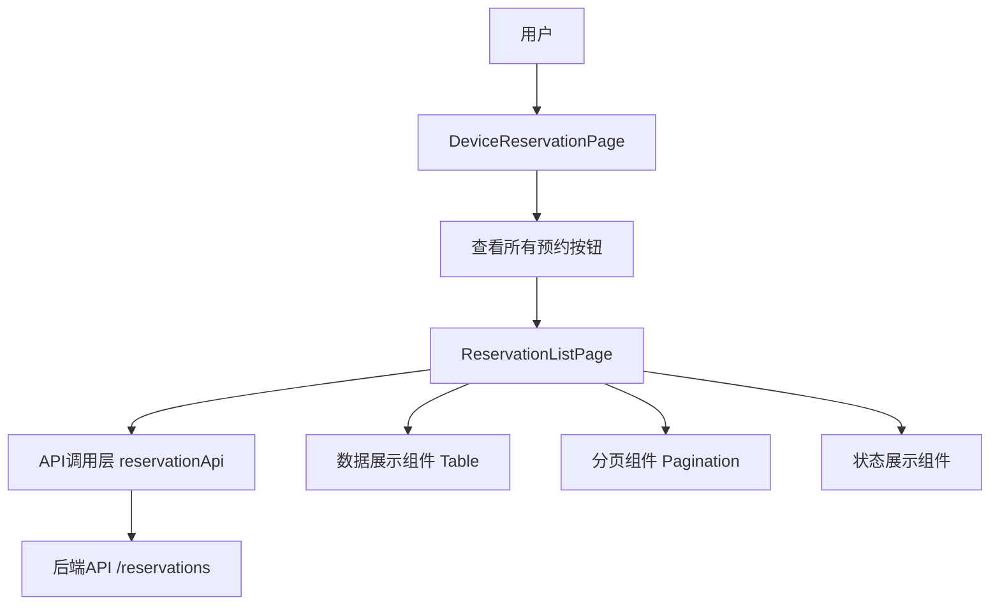
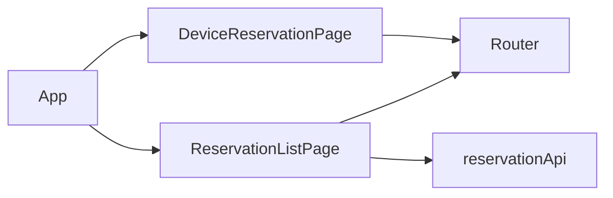
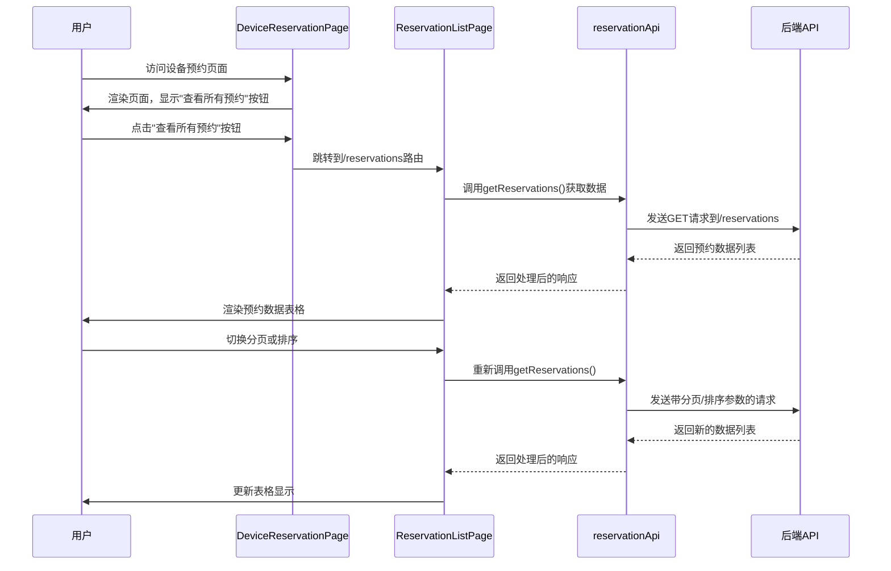
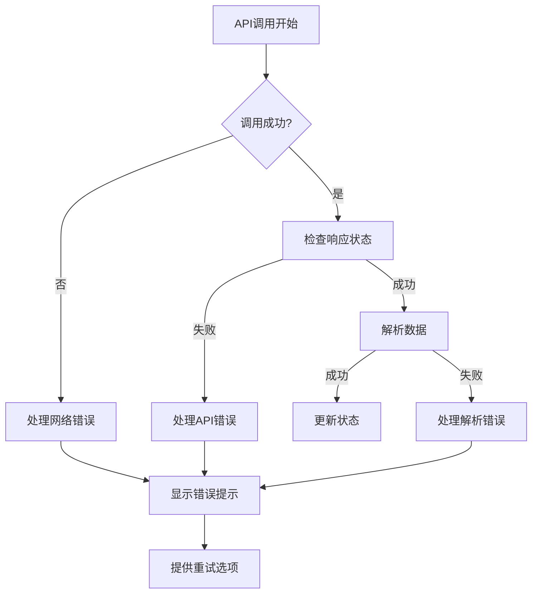

# 查看所有预约数据功能 - 架构设计文档

## 1. 架构概览

### 1.1 整体架构图


## 2. 模块划分与依赖关系

### 2.1 模块划分

| 模块名称 | 职责描述 | 文件路径 | 依赖模块 |
|---------|---------|---------|--------|
| DeviceReservationPage | 设备预约主页面，包含跳转按钮 | src/pages/DeviceReservationPage.tsx | React, Semi UI, Router |
| ReservationListPage | 预约列表展示页面 | src/pages/ReservationListPage.tsx | React, Semi UI, reservationApi |
| reservationApi | 预约数据API调用服务 | src/services/api.ts | axios |
| App | 应用入口，包含路由配置 | src/App.tsx | React Router, 各页面组件 |

### 2.2 依赖关系图


## 3. 接口定义与数据流

### 3.1 组件接口定义

#### DeviceReservationPage 组件接口
```typescript
interface DeviceReservationPageProps {
  // 现有属性保持不变
}

// 添加跳转按钮相关状态和方法
interface DeviceReservationPageState {
  // 现有状态保持不变
}

// 按钮点击处理方法
const handleViewAllReservations = () => {
  navigate('/reservations');
};
```

#### ReservationListPage 组件接口
```typescript
interface ReservationListPageProps {
  // 无特殊属性
}

interface ReservationListPageState {
  reservations: Reservation[];
  loading: boolean;
  error: string | null;
  currentPage: number;
  pageSize: number;
  total: number;
  sortField: string;
  sortOrder: 'asc' | 'desc';
}
```

### 3.2 API接口定义

使用现有的reservationApi.getReservations方法，接口定义如下：

```typescript
// 获取预约数据列表
export const reservationApi = {
  // 现有实现保持不变
  getReservations: async (params: {
    deviceId?: string;
    date?: string;
    status?: string;
    page?: number;
    pageSize?: number;
    sortField?: string;
    sortOrder?: 'asc' | 'desc';
  }) => {
    return apiClient.get<ApiResponse<{ list: Reservation[]; total: number }>>('/reservations', { params });
  },
  // 其他方法保持不变
};
```

### 3.3 数据流



## 4. 错误处理机制

### 4.1 错误类型定义

| 错误类型 | 错误信息 | 处理方式 |
|---------|---------|--------|
| 网络错误 | 网络连接失败 | 显示错误提示，提供重试按钮 |
| API错误 | API返回错误状态码 | 显示具体错误信息 |
| 数据解析错误 | 数据格式不正确 | 显示通用错误信息 |
| 权限错误 | 无权限访问数据 | 显示权限不足提示 |

### 4.2 错误处理流程



### 4.3 代码实现示例

```typescript
const fetchReservations = async () => {
  setLoading(true);
  setError(null);
  try {
    const response = await reservationApi.getReservations({
      page: currentPage,
      pageSize: pageSize,
      sortField,
      sortOrder
    });
    setReservations(response.data.list);
    setTotal(response.data.total);
  } catch (error) {
    if (error instanceof Error) {
      setError(error.message || '获取预约数据失败，请稍后重试');
    } else {
      setError('未知错误，请联系管理员');
    }
  } finally {
    setLoading(false);
  }
};
```

## 5. 性能优化考虑

### 5.1 数据加载优化
- 实现分页加载，避免一次性加载大量数据
- 添加数据缓存机制，减少重复请求
- 实现虚拟滚动，优化大数据量渲染性能

### 5.2 组件渲染优化
- 使用React.memo避免不必要的重渲染
- 优化Table组件的渲染性能
- 延迟加载非关键资源

## 6. 安全考虑

### 6.1 数据安全
- 确保所有API调用使用HTTPS
- 避免在前端存储敏感信息
- 实现请求超时和重试机制

### 6.2 防止滥用
- 限制单次请求的数据量
- 实现合理的API请求频率限制
- 防止SQL注入和XSS攻击