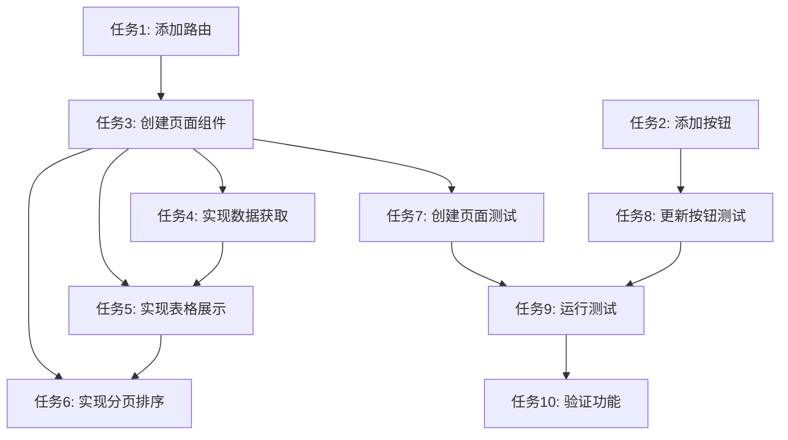

# 查看所有预约数据功能 - 任务拆分文档

## 1. 任务清单

### 任务1: 更新App.tsx，添加预约列表页面路由
- **输入**: 现有App.tsx文件
- **输出**: 更新后的App.tsx文件，包含/reservations路由配置
- **实现约束**: 使用React Router v6语法，遵循项目现有路由配置风格
- **依赖关系**: 无

### 任务2: 在DeviceReservationPage中添加"查看所有预约"按钮
- **输入**: 现有DeviceReservationPage.tsx文件
- **输出**: 更新后的DeviceReservationPage.tsx，包含按钮和跳转逻辑
- **实现约束**: 按钮放置在页面右侧，使用Semi UI Button组件，样式与现有UI一致
- **依赖关系**: 无

### 任务3: 创建ReservationListPage页面组件
- **输入**: 无（新建文件）
- **输出**: src/pages/ReservationListPage.tsx文件
- **实现约束**: 使用React函数组件，包含状态管理和数据获取逻辑
- **依赖关系**: 任务1、任务4

### 任务4: 实现预约数据获取逻辑
- **输入**: 使用现有reservationApi.getReservations方法
- **输出**: ReservationListPage中的数据获取逻辑
- **实现约束**: 实现分页、排序功能，包含错误处理和加载状态
- **依赖关系**: 无

### 任务5: 实现预约数据表格展示
- **输入**: ReservationListPage.tsx文件
- **输出**: 更新后的文件，包含Table组件实现
- **实现约束**: 使用Semi UI Table组件，显示所有必要字段，状态使用中文描述
- **依赖关系**: 任务3、任务4

### 任务6: 实现分页和排序功能
- **输入**: ReservationListPage.tsx文件
- **输出**: 更新后的文件，包含Pagination组件和排序逻辑
- **实现约束**: 使用Semi UI Pagination组件，实现基本排序功能
- **依赖关系**: 任务3、任务5

### 任务7: 创建ReservationListPage测试文件
- **输入**: 无（新建文件）
- **输出**: src/pages/__tests__/ReservationListPage.test.tsx文件
- **实现约束**: 使用React Testing Library，测试组件渲染、数据加载、错误处理等
- **依赖关系**: 任务3

### 任务8: 更新DeviceReservationPage测试文件
- **输入**: 现有DeviceReservationPage测试文件
- **输出**: 更新后的测试文件，包含按钮测试
- **实现约束**: 测试按钮存在性和点击行为
- **依赖关系**: 任务2

### 任务9: 运行测试并修复问题
- **输入**: 所有代码和测试文件
- **输出**: 测试通过结果
- **实现约束**: 确保所有测试100%通过
- **依赖关系**: 任务7、任务8

### 任务10: 验证功能并生成验收报告
- **输入**: 完整实现的功能
- **输出**: 功能验证结果和验收报告
- **实现约束**: 验证所有功能点是否正常工作
- **依赖关系**: 所有前序任务

## 2. 任务依赖图

## 3. 详细任务说明

### 3.1 任务1: 更新App.tsx，添加预约列表页面路由
1. 导入ReservationListPage组件
2. 在路由配置中添加`/reservations`路径，指向ReservationListPage
3. 确保路由配置正确，遵循项目现有风格

### 3.2 任务2: 在DeviceReservationPage中添加"查看所有预约"按钮
1. 在页面右侧（与标题区域对齐）添加Button组件
2. 按钮文本为"查看所有预约"
3. 实现onClick事件处理函数，使用navigate进行页面跳转
4. 确保按钮样式与现有UI一致

### 3.3 任务3: 创建ReservationListPage页面组件
1. 创建基础组件结构
2. 定义组件状态（reservations, loading, error, currentPage等）
3. 实现组件布局，包含页面标题、错误提示区域、数据表格区域
4. 添加必要的import语句

### 3.4 任务4: 实现预约数据获取逻辑
1. 创建fetchReservations异步函数
2. 调用reservationApi.getReservations方法
3. 实现错误处理逻辑
4. 管理loading状态和error状态
5. 更新reservations状态和total计数

### 3.5 任务5: 实现预约数据表格展示
1. 使用Semi UI Table组件
2. 定义表格列配置，包含所有必要字段
3. 实现状态字段的中文映射
4. 确保表格样式美观，信息清晰

### 3.6 任务6: 实现分页和排序功能
1. 添加Semi UI Pagination组件
2. 实现分页变化处理函数
3. 实现排序变化处理函数
4. 确保分页和排序参数正确传递给API

### 3.7 任务7: 创建ReservationListPage测试文件
1. 编写组件渲染测试
2. 编写数据加载状态测试
3. 编写错误状态测试
4. 编写表格渲染测试
5. 编写分页组件测试

### 3.8 任务8: 更新DeviceReservationPage测试文件
1. 添加按钮存在性测试
2. 添加按钮点击行为测试
3. 确保所有现有测试仍然通过

### 3.9 任务9: 运行测试并修复问题
1. 执行npm test命令
2. 分析测试失败原因
3. 修复代码或测试中的问题
4. 重新运行测试，确保全部通过

### 3.10 任务10: 验证功能并生成验收报告
1. 启动开发服务器
2. 验证按钮显示和跳转功能
3. 验证预约列表页面功能
4. 验证分页和排序功能
5. 验证错误处理功能
6. 生成功能验收报告