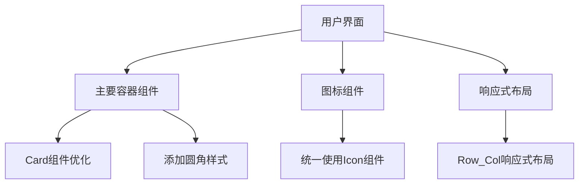

# 架构设计：优化div样式及图标

## 架构概览

本次任务主要涉及前端UI样式的优化，通过使用semi.design组件库的特性，提升页面的视觉效果和响应式能力。

## 模块划分和依赖关系

### 主要修改文件
- `src/components/ReservationCalendar.tsx` - 主要的日历组件文件，包含需要优化的div元素
- 可能涉及其他组件文件中的容器元素

### 依赖组件
- `@douyinfe/semi-ui/Card` - 用于容器元素
- `@douyinfe/semi-ui/Icon` - 用于图标统一
- `@douyinfe/semi-ui/Row` - 用于响应式布局
- `@douyinfe/semi-ui/Col` - 用于响应式布局

## 接口定义和数据流

本次任务不涉及接口定义或数据流的修改，仅修改UI展示部分。

## 错误处理机制

- 确保引入了必要的semi.design组件
- 确保样式修改不会导致布局错位或功能异常
- 确保构建过程不会产生错误
- 确保在不同屏幕尺寸下的兼容性