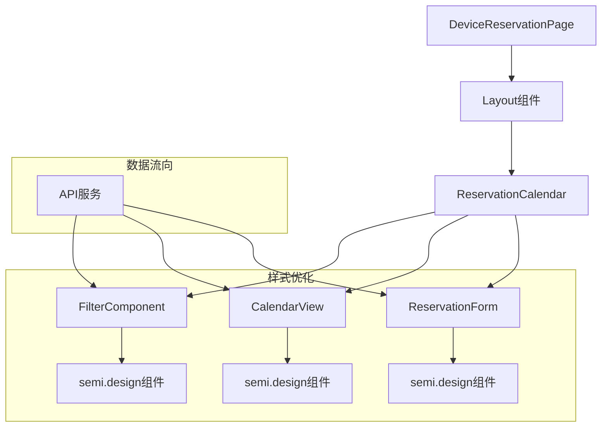

# 优化前端样式设计文档

## 架构概述

本文档详细描述了如何使用semi.design组件库优化设备预约系统的前端样式，保持功能不变的同时提升用户体验和视觉效果。

## 架构图



## 模块划分和依赖关系

### 1. 页面布局模块

- **文件**: `src/pages/DeviceReservationPage.tsx`
- **主要组件**: semi.design `Layout`
- **职责**: 提供整体页面布局框架
- **依赖**: ReservationCalendar组件

### 2. 预约日历模块

- **文件**: `src/components/ReservationCalendar.tsx`
- **主要组件**: 整合其他子组件
- **职责**: 管理预约日历的整体状态和流程
- **依赖**: FilterComponent, CalendarView, ReservationForm

### 3. 筛选组件模块

- **文件**: `src/components/FilterComponent.tsx`
- **主要组件**: semi.design `Select`, `DatePicker`, `Button`
- **职责**: 提供设备筛选和日期选择功能
- **依赖**: API服务

### 4. 日历视图模块

- **文件**: `src/components/CalendarView.tsx`
- **主要组件**: semi.design `Table`, `Card`, `Spin`, `Empty`
- **职责**: 展示设备预约情况和时间段
- **依赖**: API服务

### 5. 预约表单模块

- **文件**: `src/components/ReservationForm.tsx`
- **主要组件**: semi.design `Modal`, `Form`, `Input`, `Button`
- **职责**: 处理新预约的创建
- **依赖**: API服务

## 接口定义

### 组件接口

#### 1. FilterComponent

```typescript
interface FilterComponentProps {
  loading: boolean;
  locations: Location[];
  types: DeviceType[];
  selectedLocationId?: number;
  selectedTypeId?: number;
  selectedDate: string;
  onLocationChange: (id: number | undefined) => void;
  onTypeChange: (id: number | undefined) => void;
  onDateChange: (date: string) => void;
  onRefresh: () => void;
}
```

#### 2. CalendarView

```typescript
interface CalendarViewProps {
  selectedLocationId?: number;
  selectedTypeId?: number;
  selectedDate: string;
  onCellClick: (deviceId: number, startTime: string, endTime: string) => void;
}
```

#### 3. ReservationForm

```typescript
interface ReservationFormProps {
  visible: boolean;
  device?: Device;
  selectedTime?: { startTime: string; endTime: string };
  selectedDate: string;
  onClose: () => void;
  onSuccess: () => void;
}
```

## 样式规范

### 1. 颜色方案

- 主色调：使用semi.design默认主题色
- 预约状态颜色：
  - 已预约：蓝色系（#E1F5FE）
  - 空闲：绿色系（#F1F8E9）
  - 错误状态：红色系（#FFF1F0）

### 2. 间距规范

- 页面边距：24px
- 组件间距：16px
- 内边距：12px-20px
- 按钮间距：8px-12px

### 3. 字体规范

- 标题：16px-20px，fontWeight: 500
- 正文：14px，fontWeight: 400
- 辅助文字：12px，fontWeight: 400

### 4. 组件样式规范

- 按钮：统一使用semi.design Button组件，主要操作使用type="primary"
- 表格：使用Table组件，设置size="small"，优化列宽
- 表单：使用Form组件，统一标签和输入框样式
- 弹窗：使用Modal组件，设置合适的宽度和高度
- 加载状态：使用Spin组件，添加明确的加载提示

## 错误处理机制

1. **API调用错误**：使用Message组件显示错误信息
2. **表单验证错误**：使用Form组件的内置验证和错误提示
3. **数据加载错误**：显示友好的错误提示和重试按钮
4. **网络错误**：提示用户检查网络连接

## 响应式设计策略

1. **桌面端**（> 1200px）：完整布局，多列展示
2. **平板端**（768px-1200px）：调整表格宽度，确保可滚动
3. **移动端**（< 768px）：
   - 筛选条件垂直排列
   - 表格内容水平滚动
   - 按钮大小适当调整

## 性能优化

1. 使用React.memo优化组件重渲染
2. 合理使用useCallback和useMemo
3. 避免不必要的数据加载
4. 组件懒加载（针对大型组件）