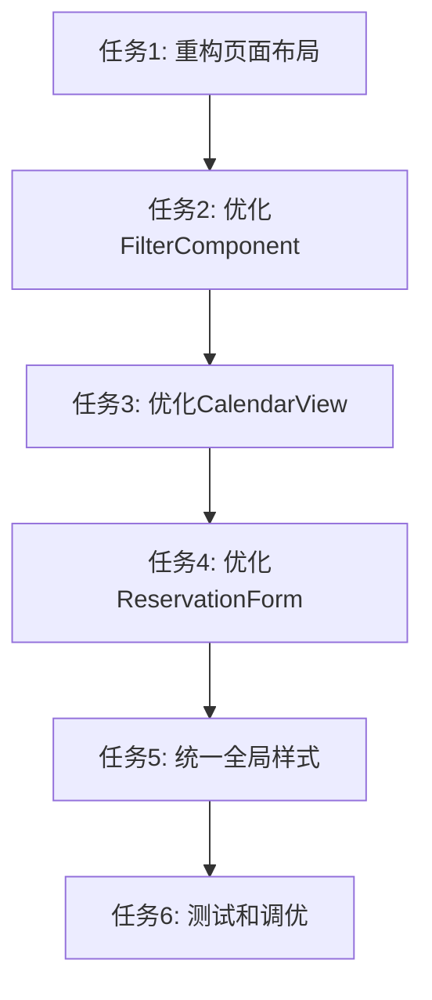

# 优化前端样式任务拆分文档

## 任务依赖图

## 任务清单

### 任务1: 重构页面布局

- **输入**: 
  - DeviceReservationPage.tsx
  - 已有semi.design Layout组件
- **输出**: 
  - 使用semi.design Layout组件重构的页面布局
  - 优化的页面边距和背景样式
- **实现约束**:
  - 使用semi.design的Layout、Header、Content组件
  - 添加合适的页面标题
  - 遵循semi.design的布局规范
- **依赖关系**: 无

### 任务2: 优化FilterComponent

- **输入**: 
  - FilterComponent.tsx
  - semi.design的Select、DatePicker、Button组件
- **输出**: 
  - 完全使用semi.design组件的筛选器
  - 优化的筛选器布局和交互
- **实现约束**:
  - 使用Card组件包裹筛选区域
  - 替换所有自定义元素为semi.design组件
  - 优化按钮和选择器的间距
- **依赖关系**: 任务1

### 任务3: 优化CalendarView

- **输入**: 
  - CalendarView.tsx
  - semi.design的Table、Card、Spin组件
- **输出**: 
  - 使用semi.design Table组件的日历视图
  - 优化的加载状态和错误提示
  - 美化的预约单元格样式
- **实现约束**:
  - 使用Card组件包裹表格
  - 使用Spin组件显示加载状态
  - 使用Empty组件显示空数据
  - 优化表格列宽和滚动体验
- **依赖关系**: 任务2

### 任务4: 优化ReservationForm

- **输入**: 
  - ReservationForm.tsx
  - semi.design的Modal、Form、Input组件
- **输出**: 
  - 使用semi.design Form组件的预约表单
  - 优化的Modal样式和交互
  - 完善的表单验证
- **实现约束**:
  - 使用Form组件进行表单控制和验证
  - 使用Modal组件展示表单
  - 添加合适的表单布局和间距
- **依赖关系**: 任务3

### 任务5: 统一全局样式

- **输入**: 
  - index.css
  - App.css
- **输出**: 
  - 与semi.design兼容的全局样式
  - 移除冲突的自定义样式
  - 优化响应式设计
- **实现约束**:
  - 移除与semi.design冲突的样式
  - 统一字体和颜色规范
  - 确保在不同设备上的适配
- **依赖关系**: 任务4

### 任务6: 测试和调优

- **输入**: 
  - 所有优化后的组件
- **输出**: 
  - 功能完整、样式一致的前端界面
  - 解决发现的问题和bug
- **实现约束**:
  - 确保所有功能正常工作
  - 检查样式一致性和响应式表现
  - 测试不同浏览器兼容性
- **依赖关系**: 任务5

## 验收标准

### 任务1验收标准
- 页面使用semi.design Layout组件
- 页面标题清晰可见
- 整体布局符合设计规范

### 任务2验收标准
- 筛选区域使用Card组件
- 所有选择器和按钮使用semi.design组件
- 交互流畅，样式一致

### 任务3验收标准
- 表格使用semi.design Table组件
- 加载状态和空数据显示正确
- 预约单元格样式美观且区分度高

### 任务4验收标准
- 表单使用semi.design Form组件
- 弹窗使用semi.design Modal组件
- 表单验证工作正常

### 任务5验收标准
- 全局样式与semi.design兼容
- 无冲突样式
- 在不同屏幕尺寸下表现良好

### 任务6验收标准
- 所有功能正常运行
- 样式美观一致
- 无明显bug或样式问题