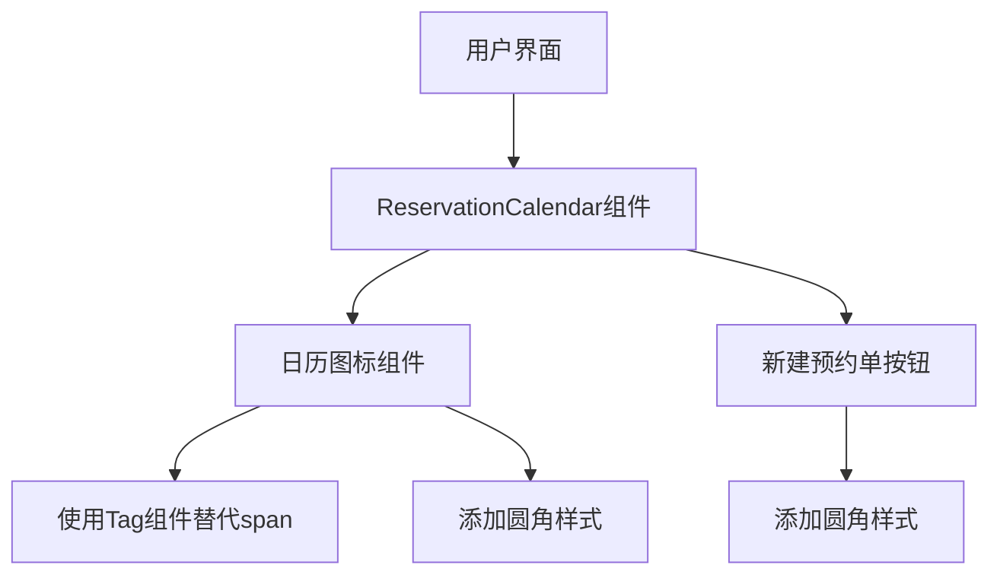

# 架构设计：为span元素添加圆角样式

## 架构概览

本次任务主要涉及前端UI样式的优化，通过修改现有组件的样式属性和组件类型，提升用户界面的视觉体验。

## 模块划分和依赖关系

### 主要修改文件
- `src/components/ReservationCalendar.tsx` - 主要的日历组件文件，包含需要修改的span元素和按钮

### 依赖组件
- `semi-ui/Tag` - 用于替换日历图标span元素
- `semi-ui/Button` - 已使用的按钮组件，需要添加样式

## 接口定义和数据流

本次任务不涉及接口定义或数据流的修改，仅修改UI展示部分。

## 错误处理机制

- 确保引入了必要的Tag组件
- 确保样式修改不会导致布局错位或功能异常
- 确保构建过程不会产生错误