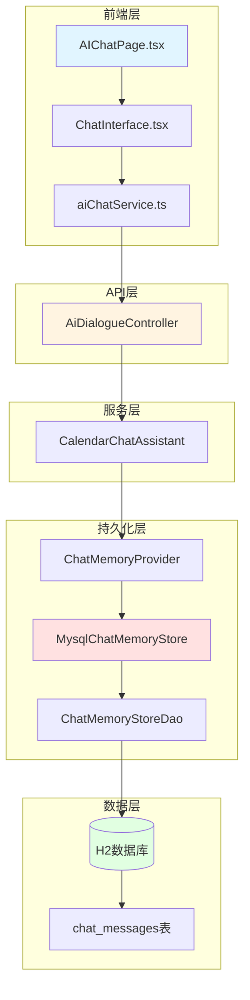
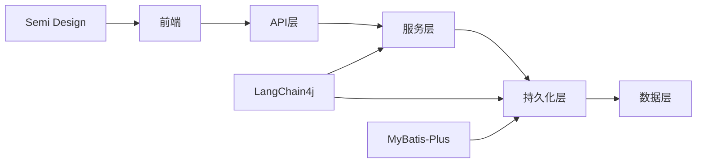
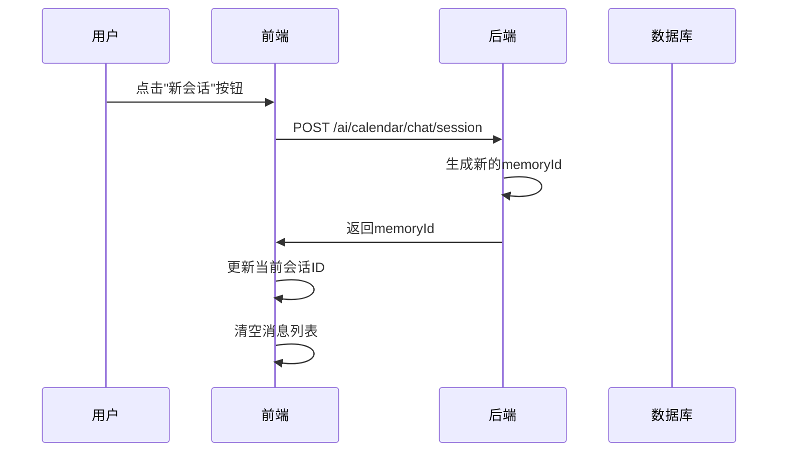
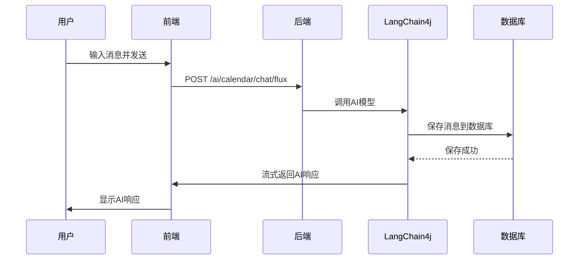
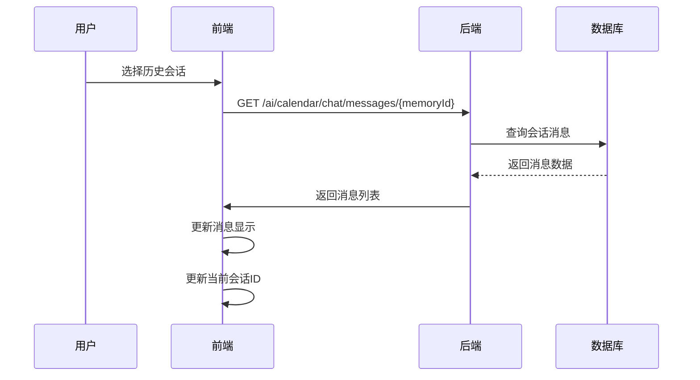

# 会话持久化功能 - 架构设计文档

## 1. 架构设计

### 1.1 整体架构图



### 1.2 模块划分

| 模块 | 职责 | 主要组件 |
|------|------|----------|
| 前端层 | 用户交互、会话管理 | AIChatPage, ChatInterface, aiChatService |
| API层 | HTTP请求处理 | AiDialogueController |
| 服务层 | AI对话逻辑 | CalendarChatAssistant |
| 持久化层 | 会话消息存储 | MysqlChatMemoryStore, ChatMemoryStoreDao |
| 数据层 | 数据存储 | H2数据库, chat_messages表 |

### 1.3 依赖关系



## 2. 数据库设计

### 2.1 表结构设计

#### chat_messages 表

```sql
CREATE TABLE IF NOT EXISTS chat_messages (
    id INT IDENTITY PRIMARY KEY,
    message_id VARCHAR(64) NOT NULL COMMENT '会话ID',
    content TEXT NOT NULL COMMENT '会话消息JSON',
    create_time TIMESTAMP DEFAULT CURRENT_TIMESTAMP COMMENT '创建时间',
    update_time TIMESTAMP DEFAULT CURRENT_TIMESTAMP COMMENT '更新时间'
) COMMENT='会话消息表';

-- 添加索引以提高查询性能
CREATE INDEX idx_message_id ON chat_messages(message_id);
CREATE INDEX idx_create_time ON chat_messages(create_time);
```

**字段说明**：

| 字段 | 类型 | 说明 | 约束 |
|------|------|------|------|
| id | INT | 主键 | PRIMARY KEY, AUTO_INCREMENT |
| message_id | VARCHAR(64) | 会话ID | NOT NULL, INDEXED |
| content | TEXT | 会话消息JSON | NOT NULL |
| create_time | TIMESTAMP | 创建时间 | DEFAULT CURRENT_TIMESTAMP |
| update_time | TIMESTAMP | 更新时间 | DEFAULT CURRENT_TIMESTAMP |

### 2.2 数据流设计

#### 消息序列化格式

使用 LangChain4j 提供的 `Json` 工具类进行序列化：

```java
// 序列化
String messagesJson = Json.toJson(messages);

// 反序列化
List<ChatMessage> messages = Json.fromJson(jsonString, List.class);
```

**JSON格式示例**：

```json
[
  {
    "type": "USER",
    "text": "你好"
  },
  {
    "type": "AI",
    "text": "你好！有什么可以帮到你的吗？"
  }
]
```

## 3. API接口设计

### 3.1 接口列表

| 接口 | 方法 | 路径 | 说明 |
|------|------|------|------|
| 创建新会话 | POST | /ai/calendar/chat/session | 生成新的会话ID |
| 发送消息（流式） | POST | /ai/calendar/chat/flux | 发送消息并流式返回响应 |
| 发送消息（非流式） | POST | /ai/calendar/chat | 发送消息并返回响应 |
| 获取会话消息 | GET | /ai/calendar/chat/messages/{memoryId} | 获取指定会话的所有消息 |
| 获取会话列表 | GET | /ai/calendar/chat/sessions | 获取所有会话列表 |
| 清空会话 | DELETE | /ai/calendar/chat/memory/{memoryId} | 清空指定会话的消息 |

### 3.2 接口详细设计

#### 3.2.1 创建新会话

**请求**：
```http
POST /ai/calendar/chat/session
Content-Type: application/json
```

**响应**：
```json
{
  "code": 200,
  "message": "success",
  "data": 1737260800000
}
```

#### 3.2.2 获取会话消息

**请求**：
```http
GET /ai/calendar/chat/messages/1737260800000
```

**响应**：
```json
{
  "code": 200,
  "message": "success",
  "data": {
    "memoryId": 1737260800000,
    "messages": [
      {
        "type": "USER",
        "text": "你好"
      },
      {
        "type": "AI",
        "text": "你好！有什么可以帮到你的吗？"
      }
    ]
  }
}
```

#### 3.2.3 获取会话列表

**请求**：
```http
GET /ai/calendar/chat/sessions
```

**响应**：
```json
{
  "code": 200,
  "message": "success",
  "data": [
    {
      "memoryId": 1737260800000,
      "title": "你好",
      "messageCount": 2,
      "createTime": "2025-01-20T10:00:00",
      "updateTime": "2025-01-20T10:01:00"
    }
  ]
}
```

## 4. 数据流设计

### 4.1 新建会话流程



### 4.2 发送消息流程



### 4.3 切换会话流程



## 5. 错误处理机制

### 5.1 错误分类

| 错误类型 | HTTP状态码 | 说明 |
|----------|------------|------|
| 参数错误 | 400 | 请求参数不合法 |
| 会话不存在 | 404 | 指定的会话ID不存在 |
| 数据库错误 | 500 | 数据库操作失败 |
| AI模型错误 | 500 | AI模型调用失败 |

### 5.2 错误响应格式

```json
{
  "code": 500,
  "message": "数据库操作失败",
  "error": "Connection timeout"
}
```

### 5.3 错误处理策略

1. **数据库操作失败**：
   - 记录详细错误日志
   - 返回明确的错误信息
   - 不降级到内存存储

2. **AI模型调用失败**：
   - 记录错误日志
   - 返回友好的错误提示
   - 不影响已保存的消息

3. **会话不存在**：
   - 返回空消息列表
   - 前端显示空状态

## 6. 性能优化

### 6.1 数据库优化

1. **索引优化**：
   - 在 `message_id` 字段上创建索引
   - 在 `create_time` 字段上创建索引

2. **查询优化**：
   - 使用 MyBatis-Plus 的分页查询
   - 限制单次查询返回的消息数量

3. **连接池优化**：
   - 使用 Druid 连接池
   - 配置合理的连接池参数

### 6.2 缓存策略

1. **会话列表缓存**：
   - 使用 Redis 缓存会话列表
   - 缓存过期时间：5分钟

2. **消息缓存**：
   - 使用 Redis 缓存最近访问的消息
   - 缓存过期时间：10分钟

### 6.3 前端优化

1. **懒加载**：
   - 会话列表按需加载
   - 消息列表按需加载

2. **防抖处理**：
   - 输入框输入防抖
   - 滚动事件防抖

## 7. 安全设计

### 7.1 数据安全

1. **SQL注入防护**：
   - 使用 MyBatis-Plus 的参数化查询
   - 避免拼接SQL语句

2. **XSS防护**：
   - 前端对用户输入进行转义
   - 使用 Semi Design 的安全组件

### 7.2 会话安全

1. **会话ID生成**：
   - 使用时间戳+随机数生成
   - 确保唯一性和不可预测性

2. **会话隔离**：
   - 不同会话的消息完全隔离
   - 通过 `memoryId` 进行访问控制

## 8. 监控与日志

### 8.1 日志记录

1. **操作日志**：
   - 记录所有数据库操作
   - 记录AI模型调用
   - 记录用户操作

2. **错误日志**：
   - 记录所有异常信息
   - 记录堆栈跟踪
   - 记录请求参数

### 8.2 性能监控

1. **响应时间监控**：
   - 监控API响应时间
   - 监控数据库查询时间

2. **资源使用监控**：
   - 监控数据库连接数
   - 监控内存使用情况

## 9. 部署考虑

### 9.1 数据库迁移

1. **表结构变更**：
   - 使用 Flyway 或 Liquibase 进行版本管理
   - 提供回滚脚本

2. **数据迁移**：
   - 从 localStorage 迁移到数据库（可选）
   - 提供数据导入工具

### 9.2 配置管理

1. **环境配置**：
   - 开发环境：使用 H2 内存数据库
   - 生产环境：使用 MySQL 或 PostgreSQL

2. **配置项**：
   - 数据库连接配置
   - 连接池配置
   - 缓存配置

## 10. 测试策略

### 10.1 单元测试

1. **后端单元测试**：
   - `MysqlChatMemoryStore` 测试
   - `ChatMemoryStoreDao` 测试
   - `AiDialogueController` 测试

2. **前端单元测试**：
   - `AIChatPage` 组件测试
   - `ChatInterface` 组件测试
   - `aiChatService` 测试

### 10.2 集成测试

1. **API集成测试**：
   - 测试所有API接口
   - 测试错误场景

2. **端到端测试**：
   - 测试完整的用户流程
   - 测试会话切换流程

## 11. 扩展性设计

### 11.1 水平扩展

1. **无状态设计**：
   - 后端服务无状态
   - 会话数据存储在数据库

2. **负载均衡**：
   - 支持多实例部署
   - 使用 Redis 共享缓存

### 11.2 功能扩展

1. **会话管理**：
   - 支持会话重命名
   - 支持会话删除
   - 支持会话搜索

2. **消息管理**：
   - 支持消息导出
   - 支持消息分享
   - 支持消息收藏
