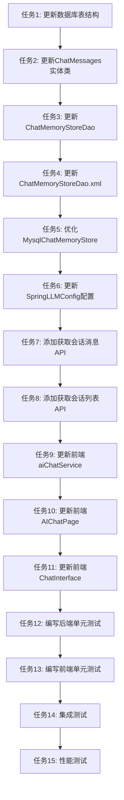

# 会话持久化功能 - 任务拆分文档

## 1. 任务依赖图

## 2. 任务清单

### 任务1: 更新数据库表结构

**输入**：
- 现有的 `chat_messages` 表结构
- 设计文档中的表结构设计

**输出**：
- 更新后的 `init.sql` 文件
- 包含新的表结构和索引

**实现约束**：
- 使用 H2 数据库兼容的 SQL 语法
- 添加 `create_time` 和 `update_time` 字段
- 在 `message_id` 和 `create_time` 字段上创建索引
- 保持向后兼容

**依赖关系**：
- 无前置依赖

**验收标准**：
- ✅ 表结构包含所有必需字段
- ✅ 索引创建成功
- ✅ SQL 语法正确，无语法错误

---

### 任务2: 更新ChatMessages实体类

**输入**：
- 现有的 `ChatMessages.java` 文件
- 更新后的数据库表结构

**输出**：
- 更新后的 `ChatMessages.java` 文件
- 包含 `createTime` 和 `updateTime` 字段

**实现约束**：
- 使用 Lombok 注解
- 字段名与数据库列名匹配
- 添加字段注释

**依赖关系**：
- 依赖任务1

**验收标准**：
- ✅ 实体类包含所有数据库字段
- ✅ 字段类型正确
- ✅ Lombok 注解正确

---

### 任务3: 更新ChatMemoryStoreDao

**输入**：
- 现有的 `ChatMemoryStoreDao.java` 文件
- 更新后的 `ChatMessages` 实体类

**输出**：
- 更新后的 `ChatMemoryStoreDao.java` 文件
- 添加获取会话列表的方法

**实现约束**：
- 继承 `BaseMapper<ChatMessages>`
- 使用 MyBatis-Plus 注解
- 添加方法注释

**依赖关系**：
- 依赖任务2

**验收标准**：
- ✅ 包含所有必需的 CRUD 方法
- ✅ 添加获取会话列表的方法
- ✅ 方法签名正确

---

### 任务4: 更新ChatMemoryStoreDao.xml

**输入**：
- 现有的 `ChatMemoryStoreDao.xml` 文件
- 更新后的 `ChatMemoryStoreDao` 接口

**输出**：
- 更新后的 `ChatMemoryStoreDao.xml` 文件
- 包含获取会话列表的 SQL 映射

**实现约束**：
- 使用 MyBatis XML 映射
- SQL 语句正确
- 结果映射正确

**依赖关系**：
- 依赖任务3

**验收标准**：
- ✅ 所有方法都有对应的 SQL 映射
- ✅ SQL 语句正确
- ✅ 结果映射正确

---

### 任务5: 优化MysqlChatMemoryStore

**输入**：
- 现有的 `MysqlChatMemoryStore.java` 文件
- LangChain4j 的 `ChatMemoryStore` 接口

**输出**：
- 优化后的 `MysqlChatMemoryStore.java` 文件
- 改进错误处理和日志记录

**实现约束**：
- 实现 `ChatMemoryStore` 接口
- 使用 LangChain4j 的 `Json` 工具类
- 添加详细的错误处理
- 添加日志记录

**依赖关系**：
- 依赖任务4

**验收标准**：
- ✅ 正确实现所有接口方法
- ✅ JSON 序列化/反序列化正确
- ✅ 错误处理完善
- ✅ 日志记录完整

---

### 任务6: 更新SpringLLMConfig配置

**输入**：
- 现有的 `SpringLLMConfig.java` 文件
- 优化后的 `MysqlChatMemoryStore`

**输出**：
- 更新后的 `SpringLLMConfig.java` 文件
- 将 `chatMemoryStore` Bean 从 `InMemoryChatMemoryStore` 切换为 `MysqlChatMemoryStore`

**实现约束**：
- 使用 `@Bean` 注解
- 注入 `ChatMemoryStoreDao`
- 添加方法注释

**依赖关系**：
- 依赖任务5

**验收标准**：
- ✅ `chatMemoryStore` Bean 正确配置
- ✅ 使用 `MysqlChatMemoryStore`
- ✅ 依赖注入正确

---

### 任务7: 添加获取会话消息API

**输入**：
- 现有的 `AiDialogueController.java` 文件
- 设计文档中的 API 接口设计

**输出**：
- 更新后的 `AiDialogueController.java` 文件
- 添加 `GET /ai/calendar/chat/messages/{memoryId}` 接口

**实现约束**：
- 使用 `@GetMapping` 注解
- 返回 `ApiResponse` 格式
- 添加方法注释
- 添加错误处理

**依赖关系**：
- 依赖任务6

**验收标准**：
- ✅ API 接口正确实现
- ✅ 返回格式正确
- ✅ 错误处理完善

---

### 任务8: 添加获取会话列表API

**输入**：
- 现有的 `AiDialogueController.java` 文件
- 设计文档中的 API 接口设计

**输出**：
- 更新后的 `AiDialogueController.java` 文件
- 添加 `GET /ai/calendar/chat/sessions` 接口

**实现约束**：
- 使用 `@GetMapping` 注解
- 返回 `ApiResponse` 格式
- 添加方法注释
- 添加错误处理

**依赖关系**：
- 依赖任务7

**验收标准**：
- ✅ API 接口正确实现
- ✅ 返回格式正确
- ✅ 错误处理完善

---

### 任务9: 更新前端aiChatService

**输入**：
- 现有的 `aiChatService.ts` 文件
- 新增的后端 API 接口

**输出**：
- 更新后的 `aiChatService.ts` 文件
- 添加获取会话消息和会话列表的方法

**实现约束**：
- 使用 TypeScript 类型定义
- 使用 fetch API
- 添加错误处理
- 添加方法注释

**依赖关系**：
- 依赖任务8

**验收标准**：
- ✅ 包含所有必需的方法
- ✅ 类型定义正确
- ✅ 错误处理完善

---

### 任务10: 更新前端AIChatPage

**输入**：
- 现有的 `AIChatPage.tsx` 文件
- 更新后的 `aiChatService`

**输出**：
- 更新后的 `AIChatPage.tsx` 文件
- 从后端 API 加载会话历史
- 实现会话切换功能

**实现约束**：
- 保持现有页面布局不变
- 保持现有按钮点位不变
- 使用 Semi Design 组件
- 添加错误处理

**依赖关系**：
- 依赖任务9

**验收标准**：
- ✅ 从后端 API 加载会话历史
- ✅ 会话切换功能正常
- ✅ 页面布局不变
- ✅ 按钮点位不变

---

### 任务11: 更新前端ChatInterface

**输入**：
- 现有的 `ChatInterface.tsx` 文件
- 更新后的 `aiChatService`

**输出**：
- 更新后的 `ChatInterface.tsx` 文件
- 从后端 API 加载会话消息
- 移除 localStorage 依赖

**实现约束**：
- 保持现有页面布局不变
- 保持现有按钮点位不变
- 使用 Semi Design 组件
- 添加错误处理

**依赖关系**：
- 依赖任务10

**验收标准**：
- ✅ 从后端 API 加载会话消息
- ✅ 移除 localStorage 依赖
- ✅ 页面布局不变
- ✅ 按钮点位不变

---

### 任务12: 编写后端单元测试

**输入**：
- 更新后的后端代码
- JUnit 测试框架

**输出**：
- `MysqlChatMemoryStoreTest.java`
- `ChatMemoryStoreDaoTest.java`
- `AiDialogueControllerTest.java`

**实现约束**：
- 使用 JUnit 5
- 使用 Mockito
- 测试覆盖率 > 80%
- 添加测试注释

**依赖关系**：
- 依赖任务11

**验收标准**：
- ✅ 所有测试通过
- ✅ 测试覆盖率 > 80%
- ✅ 测试用例完整

---

### 任务13: 编写前端单元测试

**输入**：
- 更新后的前端代码
- Jest 测试框架

**输出**：
- `aiChatService.test.ts`
- `AIChatPage.test.tsx`
- `ChatInterface.test.tsx`

**实现约束**：
- 使用 Jest
- 使用 React Testing Library
- 测试覆盖率 > 80%
- 添加测试注释

**依赖关系**：
- 依赖任务12

**验收标准**：
- ✅ 所有测试通过
- ✅ 测试覆盖率 > 80%
- ✅ 测试用例完整

---

### 任务14: 集成测试

**输入**：
- 完整的后端和前端代码
- 测试环境

**输出**：
- 集成测试报告
- 测试用例文档

**实现约束**：
- 测试完整的用户流程
- 测试所有 API 接口
- 测试错误场景
- 记录测试结果

**依赖关系**：
- 依赖任务13

**验收标准**：
- ✅ 所有集成测试通过
- ✅ 用户流程正常
- ✅ 错误场景处理正确

---

### 任务15: 性能测试

**输入**：
- 完整的代码
- 性能测试工具

**输出**：
- 性能测试报告
- 性能优化建议

**实现约束**：
- 测试 API 响应时间
- 测试数据库查询性能
- 测试并发性能
- 记录测试结果

**依赖关系**：
- 依赖任务14

**验收标准**：
- ✅ 消息保存响应时间 < 500ms
- ✅ 消息加载响应时间 < 300ms
- ✅ 会话列表加载响应时间 < 500ms

---

## 3. 任务优先级

| 任务 | 优先级 | 预计工时 |
|------|--------|----------|
| 任务1 | 高 | 0.5h |
| 任务2 | 高 | 0.5h |
| 任务3 | 高 | 0.5h |
| 任务4 | 高 | 0.5h |
| 任务5 | 高 | 1h |
| 任务6 | 高 | 0.5h |
| 任务7 | 高 | 0.5h |
| 任务8 | 高 | 0.5h |
| 任务9 | 高 | 0.5h |
| 任务10 | 高 | 1h |
| 任务11 | 高 | 1h |
| 任务12 | 中 | 1h |
| 任务13 | 中 | 1h |
| 任务14 | 中 | 1h |
| 任务15 | 低 | 0.5h |

**总计**：约 10 小时

## 4. 风险与应对

### 4.1 技术风险

| 风险 | 应对措施 |
|------|----------|
| LangChain4j JSON序列化问题 | 使用 LangChain4j 提供的 `Json` 工具类 |
| H2数据库兼容性问题 | 测试H2数据库的SQL语法兼容性 |
| 前后端数据同步问题 | 统一数据格式和错误处理 |

### 4.2 进度风险

| 风险 | 应对措施 |
|------|----------|
| 任务延期 | 调整任务优先级，优先完成核心功能 |
| 测试不通过 | 及时修复bug，确保测试通过 |

## 5. 交付物清单

### 5.1 代码交付物

- [ ] 更新后的 `init.sql`
- [ ] 更新后的 `ChatMessages.java`
- [ ] 更新后的 `ChatMemoryStoreDao.java`
- [ ] 更新后的 `ChatMemoryStoreDao.xml`
- [ ] 更新后的 `MysqlChatMemoryStore.java`
- [ ] 更新后的 `SpringLLMConfig.java`
- [ ] 更新后的 `AiDialogueController.java`
- [ ] 更新后的 `aiChatService.ts`
- [ ] 更新后的 `AIChatPage.tsx`
- [ ] 更新后的 `ChatInterface.tsx`

### 5.2 测试交付物

- [ ] 后端单元测试代码
- [ ] 前端单元测试代码
- [ ] 集成测试报告
- [ ] 性能测试报告

### 5.3 文档交付物

- [ ] 需求对齐文档
- [ ] 架构设计文档
- [ ] 任务拆分文档
- [ ] 验收报告
- [ ] 最终报告

## 6. 验收标准

### 6.1 功能验收

- [ ] 新建会话后，会话ID正确生成并返回
- [ ] 发送消息后，消息正确保存到数据库
- [ ] 切换到历史会话后，能正确加载完整的历史消息
- [ ] 在历史会话中继续对话，新消息正确追加并保存
- [ ] 数据库操作失败时，有明确的错误提示

### 6.2 性能验收

- [ ] 消息保存响应时间 < 500ms
- [ ] 消息加载响应时间 < 300ms
- [ ] 会话列表加载响应时间 < 500ms

### 6.3 代码质量验收

- [ ] 所有代码符合项目现有规范
- [ ] 所有公共方法有函数级注释
- [ ] 所有测试用例通过
- [ ] 无 lint 错误和警告
- [ ] 测试覆盖率 > 80%

## 7. 下一步行动

等待用户确认以下内容：

1. 任务拆分是否合理？
2. 任务优先级是否合适？
3. 预计工时是否合理？
4. 验收标准是否明确？

用户确认后，将进入 **Approve（方案审批）** 阶段。
