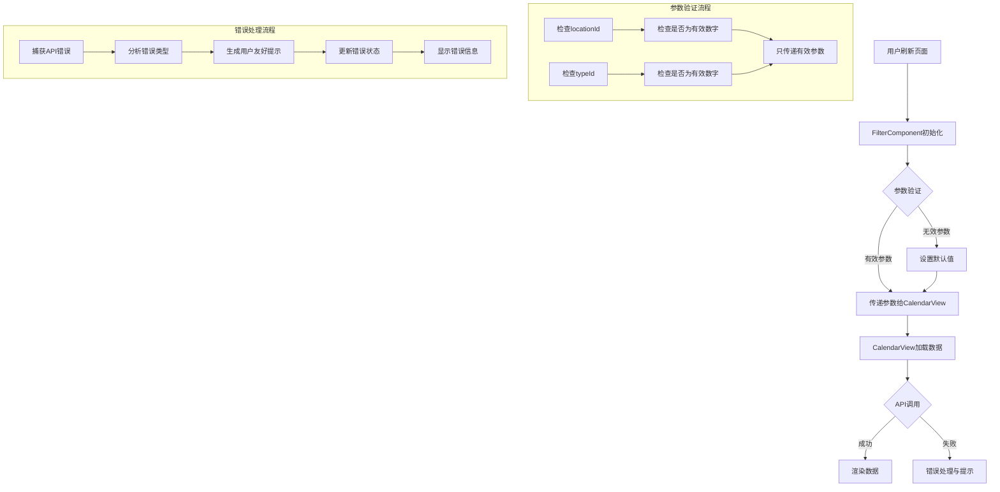
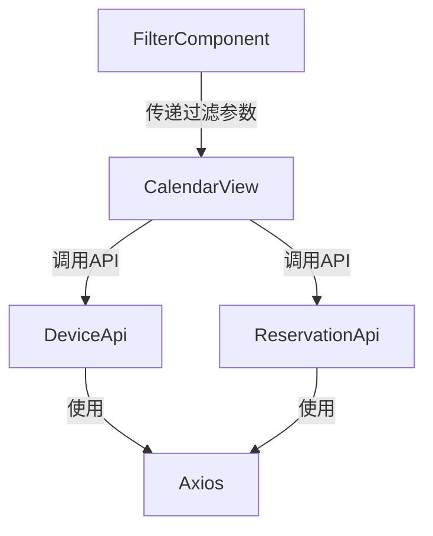

# 架构设计文档：修复刷新页面未选择过滤条件错误

## 架构概述

### 问题分析

当前系统在刷新页面且未选择地点和设备过滤条件时出现错误，主要原因在于：

1. **参数处理问题**：当未选择过滤条件时，可能将无效参数（如undefined或空字符串）传递给API
2. **数据流异常**：FilterComponent和CalendarView组件之间的数据传递可能存在边界情况未处理
3. **错误处理不足**：在参数无效的情况下，错误处理机制不够健壮

### 修复架构图



## 模块划分与依赖关系

### 核心模块

1. **FilterComponent**：负责过滤条件的设置和用户交互
   - 依赖：React, Semi UI的Select和DatePicker组件
   - 输出：selectedLocationId, selectedTypeId, selectedDate

2. **CalendarView**：负责数据展示和预约功能
   - 依赖：FilterComponent的输出, deviceApi, reservationApi
   - 输入：selectedLocationId, selectedTypeId, selectedDate

3. **API服务层**：处理与后端的通信
   - 依赖：axios
   - 输出：设备数据和预约数据

### 依赖关系图



## 接口定义和数据流

### 组件间接口

1. **FilterComponent输出**
   - `selectedLocationId: number | undefined | null`
   - `selectedTypeId: number | undefined | null`
   - `selectedDate: string`

2. **CalendarView输入**
   - `selectedLocationId: number | undefined | null`
   - `selectedTypeId: number | undefined | null`
   - `selectedDate: string`

### 数据流

1. **初始加载流程**：
   - FilterComponent初始化，设置默认值
   - 将初始参数传递给CalendarView
   - CalendarView验证参数并调用API
   - 渲染数据或错误信息

2. **参数变化流程**：
   - 用户更改过滤条件
   - FilterComponent更新状态
   - 新参数传递给CalendarView
   - CalendarView重新加载数据

## 错误处理机制

### 错误类型与处理

1. **参数验证错误**
   - 检测：在传递参数前进行类型和值验证
   - 处理：使用默认值或不传递无效参数
   - 日志：记录参数验证情况

2. **API调用错误**
   - 检测：捕获axios错误
   - 处理：根据错误类型提供不同的用户提示
   - 日志：记录详细的错误信息，包括URL、方法、状态码等

3. **数据处理错误**
   - 检测：在处理API响应数据时进行有效性检查
   - 处理：使用默认空数据或友好提示
   - 日志：记录数据格式异常

## 技术实现要点

### 1. FilterComponent优化

```typescript
// 确保状态初始值合理
const [selectedLocationId, setSelectedLocationId] = useState<number | null>(null);
const [selectedTypeId, setSelectedTypeId] = useState<number | null>(null);

// 组件卸载前清理状态
useEffect(() => {
  return () => {
    // 可选的清理逻辑
  };
}, []);
```

### 2. CalendarView优化

```typescript
// 数据加载前的参数验证
const loadData = async () => {
  setLoading(true);
  setError(null);
  try {
    // 只构建包含有效参数的对象
    const params: { locationId?: number; typeId?: number } = {};
    if (selectedLocationId !== undefined && selectedLocationId !== null && !isNaN(selectedLocationId)) {
      params.locationId = selectedLocationId;
    }
    if (selectedTypeId !== undefined && selectedTypeId !== null && !isNaN(selectedTypeId)) {
      params.typeId = selectedTypeId;
    }
    
    // 调用API，只传递有效参数
    const devicesResponse = await deviceApi.getDevices(params);
    // 处理响应...
  } catch (err) {
    // 错误处理...
  }
};
```

### 3. API服务层优化

```typescript
// 确保请求拦截器正确处理空参数
instance.interceptors.request.use(
  (config) => {
    // 清理请求参数中的无效值
    if (config.params) {
      Object.keys(config.params).forEach(key => {
        if (config.params[key] === undefined || config.params[key] === null) {
          delete config.params[key];
        }
      });
    }
    return config;
  },
  (error) => {
    return Promise.reject(error);
  }
);
```

## 性能考虑

1. **避免不必要的API调用**：
   - 添加参数比较逻辑，只有当参数真正变化时才重新加载数据
   - 使用防抖或节流处理频繁的参数变化

2. **优化数据处理**：
   - 减少不必要的数据转换和处理
   - 使用适当的数据结构提高查找效率

3. **加载状态管理**：
   - 实现精确的加载状态控制，避免不必要的UI闪烁
   - 提供加载指示器，改善用户体验

## 测试策略

1. **单元测试**：
   - 测试参数验证逻辑
   - 测试错误处理机制

2. **集成测试**：
   - 测试组件间的数据传递
   - 测试API调用和响应处理

3. **场景测试**：
   - 测试刷新页面且未选择过滤条件的情况
   - 测试各种过滤条件组合下的行为