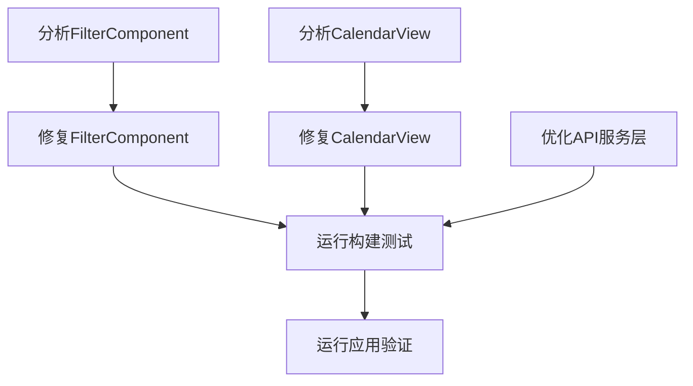

# 任务拆分文档：修复刷新页面未选择过滤条件错误

## 任务拆分

### T1: 分析FilterComponent组件
**目标**: 了解FilterComponent的状态管理和默认值设置

**输入**: 
- FilterComponent.tsx文件

**输出**: 
- 组件状态初始值和参数传递机制的详细分析

**实现约束**: 
- 不修改代码，仅进行分析
- 关注selectedLocationId和selectedTypeId的默认值

### T2: 分析CalendarView组件
**目标**: 了解CalendarView的数据加载逻辑和参数验证

**输入**: 
- CalendarView.tsx文件

**输出**: 
- 数据加载流程和参数处理逻辑的详细分析
- 错误发生点的精确定位

**实现约束**: 
- 不修改代码，仅进行分析
- 关注参数验证和API调用部分

### T3: 修复FilterComponent组件
**目标**: 优化FilterComponent的状态管理和默认值设置

**输入**: 
- T1的分析结果
- FilterComponent.tsx文件

**输出**: 
- 修复后的FilterComponent组件，确保状态初始值合理

**实现约束**: 
- 保持现有UI不变
- 确保状态初始值合理（null或特定默认值）
- 遵循React最佳实践

### T4: 修复CalendarView组件
**目标**: 优化CalendarView的参数验证和API调用

**输入**: 
- T2的分析结果
- CalendarView.tsx文件

**输出**: 
- 修复后的CalendarView组件，确保正确处理空参数

**实现约束**: 
- 只修改参数验证和API调用部分
- 确保未选择过滤条件时也能正常加载数据
- 添加适当的错误处理

### T5: 优化API服务层
**目标**: 确保API服务层正确处理空参数

**输入**: 
- api.ts文件

**输出**: 
- 优化后的API服务层，能够正确处理空参数

**实现约束**: 
- 只修改请求拦截器或参数处理部分
- 不改变API调用的结果格式

### T6: 运行构建测试
**目标**: 验证修复后的代码能否成功构建

**输入**: 
- 修复后的代码

**输出**: 
- 构建成功的确认
- 如构建失败，提供错误信息

**实现约束**: 
- 执行npm run build命令
- 确保无编译错误

### T7: 运行应用验证
**目标**: 确认问题已解决，应用在各种条件下都能正常运行

**输入**: 
- 修复后的应用

**输出**: 
- 应用运行状态报告
- 问题解决确认

**实现约束**: 
- 启动开发服务器
- 测试各种过滤条件组合
- 验证刷新页面且未选择过滤条件的情况

## 任务依赖图

## 详细任务描述

### T1: 分析FilterComponent组件

1. 检查组件的状态定义和初始值
2. 分析selectedLocationId和selectedTypeId的默认设置
3. 查看组件如何处理未选择过滤条件的情况
4. 检查组件卸载时的状态清理

### T2: 分析CalendarView组件

1. 检查组件如何接收和处理FilterComponent传递的参数
2. 分析loadData函数中的参数验证逻辑
3. 查看API调用部分如何处理空参数
4. 定位可能导致错误的代码行

### T3: 修复FilterComponent组件

1. 确保selectedLocationId和selectedTypeId的初始值设置为null或undefined
2. 添加参数类型检查，确保类型安全
3. 优化状态更新逻辑，避免设置无效值
4. 添加组件卸载时的状态清理（如需要）

### T4: 修复CalendarView组件

1. 增强loadData函数中的参数验证，正确处理null和undefined值
2. 优化params对象的构建，只包含有效参数
3. 添加详细的日志记录，便于调试
4. 增强错误处理，提供更友好的用户提示

### T5: 优化API服务层

1. 在请求拦截器中添加参数清理逻辑
2. 确保只传递有效的参数给后端API
3. 添加详细的请求日志记录
4. 优化错误处理，提供更详细的错误信息

### T6: 运行构建测试

1. 在前端目录执行npm run build命令
2. 检查构建输出，确保无编译错误
3. 如有错误，修复后重新构建

### T7: 运行应用验证

1. 启动开发服务器（npm run dev）
2. 测试以下场景：
   - 刷新页面且未选择任何过滤条件
   - 选择地点但不选择设备类型
   - 选择设备类型但不选择地点
   - 选择地点和设备类型
3. 确认所有场景下应用都能正常运行且无错误

## 验收标准

1. 刷新页面且未选择地点和设备时，应用不再报错
2. 各种过滤条件组合下，数据都能正常加载和显示
3. 代码构建成功，无编译错误
4. 应用运行稳定，无性能退化