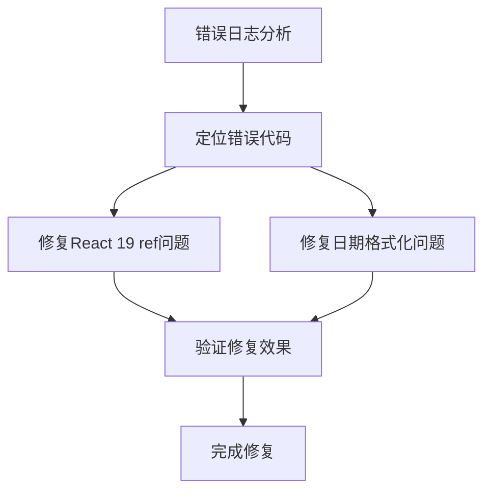

# 修复前端日志错误 - 架构设计文档

## 架构流程图



## 模块划分和依赖关系

| 模块名称 | 职责 | 可能的文件位置 | 依赖关系 |
|---------|------|---------------|--------|
| ref处理模块 | 处理React 19中的ref使用方式 | hooks/useClickOutside.ts及其他使用ref的组件 | React 19 API |
| 日期格式化模块 | 处理日期格式的正确使用 | FilterComponent.tsx、ReservationCalendar.tsx等 | semi-ui日期组件 |

## 接口定义和数据流

### 1. React 19 ref修复

**修改前：**
```typescript
// 可能的问题代码模式
useEffect(() => {
  const handleClickOutside = (event: MouseEvent) => {
    if (elementRef.current && !elementRef.current.contains(event.target as Node)) {
      onClose();
    }
  };
  // ...
}, []);
```

**修改后：**
```typescript
// React 19兼容的方式
useEffect(() => {
  const handleClickOutside = (event: MouseEvent) => {
    if (elementRef && !elementRef.contains(event.target as Node)) {
      onClose();
    }
  };
  // ...
}, []);
```

### 2. 日期格式化修复

**修改前：**
```typescript
// 可能的问题代码模式
const dateFormat = 'YYYY-MM-DD';
const formattedDate = format(date, dateFormat);
```

**修改后：**
```typescript
// 正确的格式
const dateFormat = 'yyyy-MM-DD';
const formattedDate = format(date, dateFormat);
```

## 错误处理机制

1. **编译时错误**：使用TypeScript类型检查确保ref使用方式正确
2. **运行时错误**：添加适当的空值检查，避免空引用错误
3. **日志监控**：修复后监控控制台日志，确保没有新的错误产生

## 代码结构示例

### 1. 修复ref使用问题的示例代码

```typescript
// 修改useClickOutside hook
const useClickOutside = (ref: React.RefObject<HTMLElement>, callback: () => void) => {
  useEffect(() => {
    const handleClickOutside = (event: MouseEvent) => {
      // 修复：检查ref.current是否存在
      if (ref.current && !ref.current.contains(event.target as Node)) {
        callback();
      }
    };
    
    document.addEventListener('mousedown', handleClickOutside);
    return () => {
      document.removeEventListener('mousedown', handleClickOutside);
    };
  }, [ref, callback]);
};
```

### 2. 修复日期格式化问题的示例代码

```typescript
// 修改日期格式化模式
// 旧代码
// const dateFormat = 'YYYY-MM-DD';

// 新代码
const dateFormat = 'yyyy-MM-DD';
```