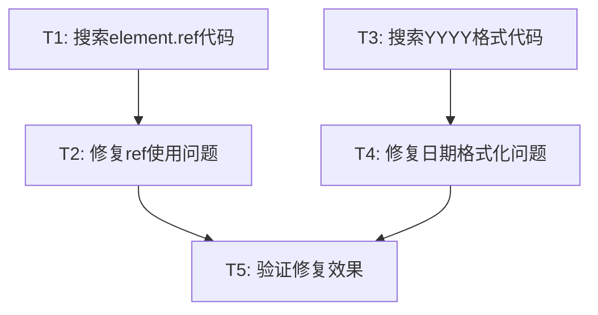

# 修复前端日志错误 - 任务拆分文档

## 任务列表

| 任务ID | 任务描述 | 输入 | 输出 | 实现约束 |
|-------|---------|------|------|--------|
| T1 | 搜索项目中使用element.ref的代码 | 项目代码库 | 问题代码位置报告 | 使用search_codebase工具 |
| T2 | 修复React 19 ref使用问题 | 问题代码位置 | 修复后的代码 | 确保兼容React 19 |
| T3 | 搜索项目中使用YYYY格式的日期格式化代码 | 项目代码库 | 问题代码位置报告 | 使用search_codebase工具 |
| T4 | 修复日期格式化中的YYYY问题 | 问题代码位置 | 修复后的代码 | 将YYYY改为yyyy |
| T5 | 验证修复效果 | 修复后的代码 | 错误日志是否消失 | 重启前端服务检查 |

## 任务依赖图

## 任务详情

### T1: 搜索项目中使用element.ref的代码

**输入**：项目代码库
**输出**：包含element.ref使用的文件列表和位置
**实现约束**：使用search_codebase工具搜索相关代码

### T2: 修复React 19 ref使用问题

**输入**：T1的搜索结果
**输出**：修复后的代码，移除element.ref的直接访问
**实现约束**：
- 遵循React 19的ref使用规范
- 特别关注useClickOutside等自定义Hook
- 确保功能正常工作

### T3: 搜索项目中使用YYYY格式的日期格式化代码

**输入**：项目代码库
**输出**：包含YYYY格式使用的文件列表和位置
**实现约束**：使用search_codebase工具搜索相关代码

### T4: 修复日期格式化中的YYYY问题

**输入**：T3的搜索结果
**输出**：修复后的代码，将YYYY改为yyyy
**实现约束**：
- 保持其他日期格式不变
- 确保日期格式化功能正常工作

### T5: 验证修复效果

**输入**：T2和T4的修复结果
**输出**：修复验证报告
**实现约束**：
- 重启前端服务
- 检查控制台日志是否仍有相关错误
- 验证相关功能是否正常工作

## 风险评估

| 风险描述 | 风险等级 | 缓解措施 |
|---------|---------|--------|
| 修复ref问题可能影响现有功能 | 中 | 修改后仔细测试相关组件功能 |
| 日期格式修改可能影响后端数据交互 | 低 | 确认后端接收的日期格式要求 |
| React 19的其他兼容性问题 | 中 | 检查React 19迁移文档，确保全面兼容 |