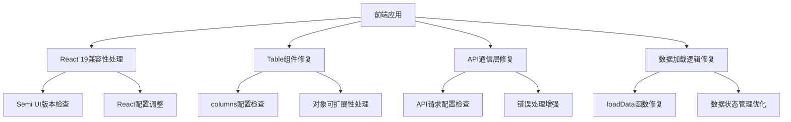
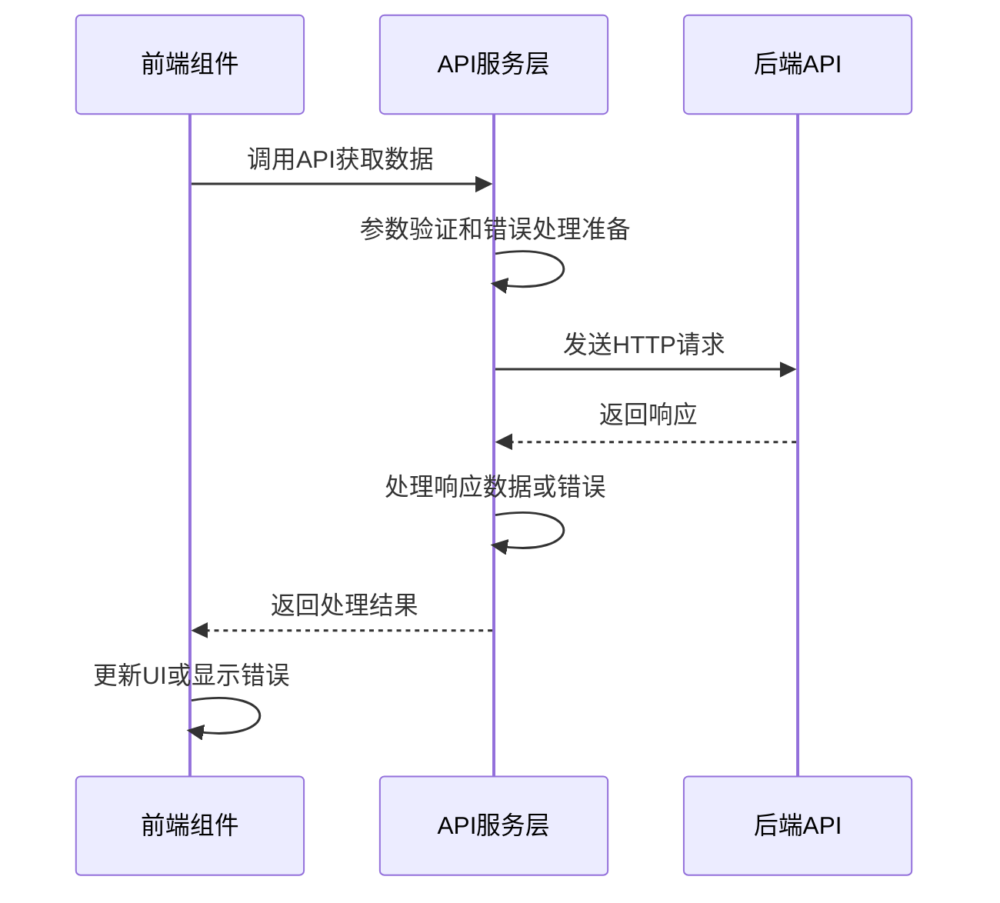

# 修复前端日志错误架构设计文档

## 架构概览

根据前端日志分析，我们需要修复多个相互关联的问题。以下是问题修复的架构设计：

## 模块划分和依赖关系

### 1. React 19兼容性模块
- **功能**：解决React 19中element.ref已移除的警告
- **依赖**：React核心库、Semi UI组件库
- **修复策略**：检查Semi UI版本，考虑升级或添加兼容性处理

### 2. Table组件修复模块
- **功能**：解决Table组件的filteredValue错误
- **依赖**：Semi UI Table组件、React对象操作
- **修复策略**：确保columns配置对象可扩展，避免对象冻结

### 3. API通信修复模块
- **功能**：解决API请求错误和服务器内部错误
- **依赖**：axios/fetch库、API服务配置
- **修复策略**：检查请求URL、参数、错误处理逻辑

### 4. 数据加载修复模块
- **功能**：解决CalendarView中的数据加载失败问题
- **依赖**：API通信模块、React状态管理
- **修复策略**：优化loadData函数，增强错误处理和重试机制

## 接口定义和数据流

### API接口调用流程

## 错误处理机制

1. **API错误处理增强**：
   - 添加详细的错误日志记录
   - 实现自动重试机制（针对网络临时故障）
   - 提供友好的用户错误提示

2. **组件错误处理**：
   - 为关键组件添加错误边界（Error Boundary）
   - 实现Table组件配置的防御性编程
   - 防止一个组件错误影响整个应用

## 代码优化策略

1. **对象操作优化**：
   - 使用深拷贝处理配置对象
   - 避免直接修改props或冻结对象

2. **React最佳实践**：
   - 确保正确使用React 19的新特性
   - 遵循React Hooks规则
   - 优化组件渲染性能

3. **依赖管理**：
   - 确保所有依赖库版本兼容
   - 考虑锁定依赖版本以避免意外升级