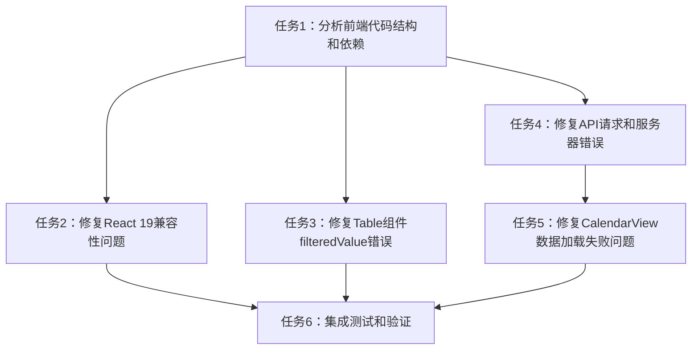

# 修复前端日志错误任务拆分文档

## 任务列表

### 任务1：分析前端代码结构和依赖
- **输入**：项目代码库
- **输出**：代码结构分析报告
- **实现约束**：使用项目现有技术栈
- **依赖关系**：无

### 任务2：修复React 19兼容性问题
- **输入**：任务1的分析结果
- **输出**：解决element.ref警告的修复代码
- **实现约束**：
  - 检查Semi UI版本与React 19的兼容性
  - 必要时添加兼容性配置
- **依赖关系**：任务1

### 任务3：修复Table组件filteredValue错误
- **输入**：项目中使用Table组件的代码
- **输出**：修复后的Table组件配置
- **实现约束**：
  - 确保columns配置对象可扩展
  - 使用深拷贝避免对象被冻结
- **依赖关系**：任务1

### 任务4：修复API请求和服务器错误
- **输入**：API服务层代码
- **输出**：修复后的API通信逻辑
- **实现约束**：
  - 检查请求URL和参数
  - 增强错误处理机制
- **依赖关系**：任务1

### 任务5：修复CalendarView数据加载失败问题
- **输入**：CalendarView组件代码
- **输出**：修复后的loadData函数
- **实现约束**：
  - 优化数据加载逻辑
  - 添加错误处理和重试机制
- **依赖关系**：任务4

### 任务6：集成测试和验证
- **输入**：所有修复后的代码
- **输出**：测试报告
- **实现约束**：
  - 确保所有错误已修复
  - 验证功能正常
- **依赖关系**：任务2-5

## 任务依赖图

## 任务详情

### 任务1：分析前端代码结构和依赖
1. 检查package.json了解依赖版本
2. 分析前端组件结构
3. 识别关键文件和组件

### 任务2：修复React 19兼容性问题
1. 检查Semi UI版本
2. 考虑升级Semi UI或添加兼容性配置
3. 修复任何直接使用element.ref的代码

### 任务3：修复Table组件filteredValue错误
1. 查找项目中使用Table组件的地方
2. 检查columns配置是否被冻结
3. 修改为使用可扩展的对象配置

### 任务4：修复API请求和服务器错误
1. 检查API请求配置
2. 审查错误处理逻辑
3. 添加调试信息

### 任务5：修复CalendarView数据加载失败问题
1. 分析loadData函数
2. 添加错误处理
3. 实现重试机制

### 任务6：集成测试和验证
1. 启动前后端服务
2. 测试所有功能
3. 验证错误是否已消除