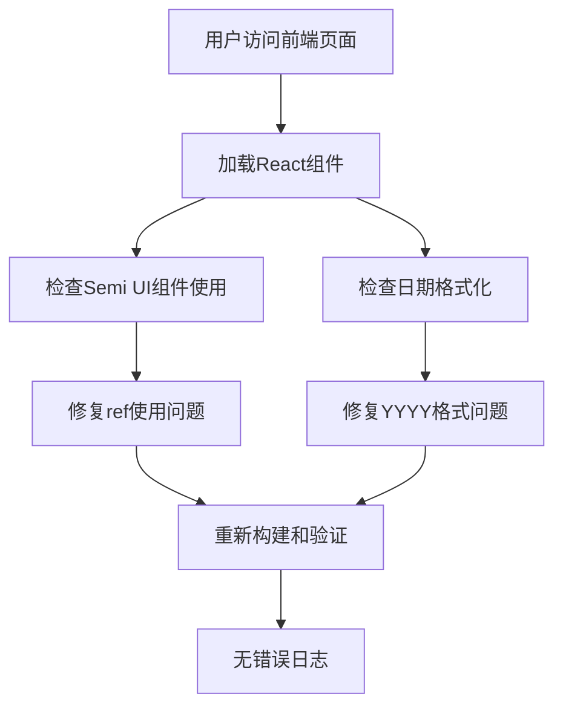

## 架构流程图



## 模块划分和依赖关系

| 模块 | 主要职责 | 依赖关系 |
|------|----------|----------|
| Semi UI组件使用 | 提供UI交互元素 | React, Semi UI库 |
| 日期格式化 | 处理日期显示和操作 | dayjs或date-fns |
| React引用管理 | 管理DOM引用 | React 19 |

## 接口定义和数据流

### React 19 ref修复

错误模式：
```tsx
// 错误的ref使用方式
element.ref = myRef;
```

正确模式：
```tsx
// 正确的ref使用方式
<div ref={myRef} />
```

### 日期格式化修复

错误模式：
```tsx
// 错误的日期格式化
date.format('YYYY-MM-DD');
dayjs(date).format('YYYY-MM-DD');
```

正确模式：
```tsx
// 正确的日期格式化
date.format('yyyy-MM-DD');
dayjs(date).format('yyyy-MM-DD');
```

## 错误处理机制

1. 搜索并修复所有使用 `element.ref` 的代码
2. 搜索并修复所有使用 `YYYY` 进行日期格式化的代码
3. 对Semi UI组件的使用进行检查，确保符合React 19规范
4. 修改后进行全面测试，确保功能正常

## 代码结构示例

```tsx
// 修复后的ref使用示例
import React, { useRef } from 'react';
import { Select } from '@douyinfe/semi-ui';

function MyComponent() {
  const selectRef = useRef<HTMLDivElement>(null);
  
  return (
    <Select
      ref={selectRef}
      // 其他属性
    />
  );
}

// 修复后的日期格式化示例
import dayjs from 'dayjs';

function formatDate(date: Date) {
  return dayjs(date).format('yyyy-MM-DD');
}
```