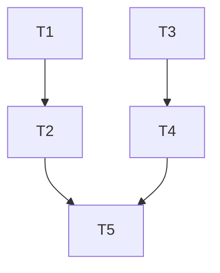

## 任务拆分

### T1: 全面搜索前端代码中的 element.ref 使用
- **输入**: 前端源代码目录
- **输出**: 所有使用 element.ref 的文件和位置
- **实现约束**: 使用 search_codebase 工具搜索
- **依赖关系**: 无

### T2: 修复 Semi UI 组件中的 ref 使用问题
- **输入**: T1 的搜索结果
- **输出**: 修复后的组件代码
- **实现约束**: 遵循 React 19 的 ref 使用规范
- **依赖关系**: T1

### T3: 全面搜索前端代码中的 YYYY 日期格式化
- **输入**: 前端源代码目录
- **输出**: 所有使用 YYYY 进行日期格式化的文件和位置
- **实现约束**: 使用 search_codebase 工具搜索，确保无遗漏
- **依赖关系**: 无

### T4: 修复所有 YYYY 日期格式化问题
- **输入**: T3 的搜索结果
- **输出**: 修复后的日期格式化代码
- **实现约束**: 将所有 YYYY 替换为 yyyy
- **依赖关系**: T3

### T5: 验证修复效果
- **输入**: 修复后的前端代码
- **输出**: 验证报告
- **实现约束**: 重启前端服务，检查控制台日志
- **依赖关系**: T2, T4

## 任务依赖图

## 风险评估

| 风险项 | 可能性 | 影响 | 缓解措施 |
|--------|--------|------|----------|
| Semi UI 版本与 React 19 不兼容 | 中 | 高 | 检查 Semi UI 版本，必要时更新组件库 |
| 日期格式化错误可能存在于未被搜索到的文件中 | 中 | 中 | 使用更全面的搜索策略，包括依赖库的使用 |
| 修复后可能引入新的问题 | 低 | 中 | 仔细验证每处修改，确保功能正常 |