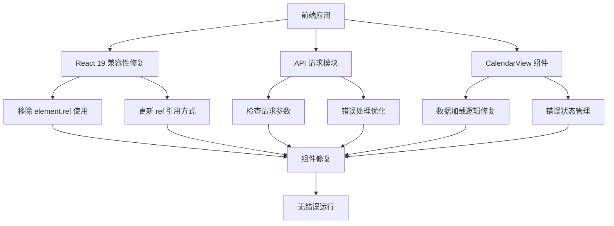

# 修复前端运行时错误 - 架构设计文档

## 架构图

## 模块划分和依赖关系

### 1. React 19 兼容性模块
- **负责**: 修复所有使用 element.ref 的代码
- **依赖**: React 19 API
- **涉及文件**: 所有使用 ref 的组件

### 2. API 请求模块
- **负责**: 修复API请求错误
- **依赖**: Axios, 后端API接口
- **涉及文件**: services/api.ts

### 3. CalendarView 组件模块
- **负责**: 修复数据加载和错误处理
- **依赖**: API请求模块, Semi UI组件
- **涉及文件**: components/CalendarView.tsx

## 接口定义和数据流

### 1. API接口修复
- 检查services/api.ts中的请求格式
- 确保请求参数符合后端要求
- 优化错误处理逻辑

### 2. CalendarView数据流程
1. 组件挂载时触发数据加载
2. 调用API服务获取数据
3. 处理响应数据或错误
4. 更新UI状态

## 错误处理机制
1. 全局错误处理: 捕获并记录API请求错误
2. 组件级错误处理: 为CalendarView添加错误状态管理
3. 用户反馈: 提供友好的错误提示

## 技术实现要点
1. React 19中ref不再作为element的属性，需要使用正确的引用方式
2. API请求需要检查请求头、参数格式等
3. 数据加载需要添加加载状态和错误状态管理