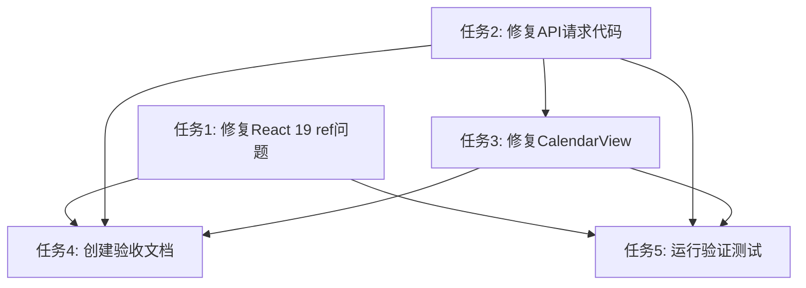

# 修复前端运行时错误 - 任务拆分文档

## 任务列表

### 任务1: 查找并修复React 19 ref相关问题
- **输入**: 代码库中使用element.ref的文件
- **输出**: 修复后的代码，不再使用element.ref
- **实现约束**: 遵循React 19 API规范
- **依赖关系**: 无

### 任务2: 检查并修复API请求代码
- **输入**: services/api.ts文件
- **输出**: 修复后的API请求逻辑
- **实现约束**: 确保请求格式正确，添加适当的错误处理
- **依赖关系**: 无

### 任务3: 修复CalendarView组件的数据加载逻辑
- **输入**: components/CalendarView.tsx文件
- **输出**: 修复后的数据加载和错误处理逻辑
- **实现约束**: 使用Semi UI组件，优化错误状态管理
- **依赖关系**: 任务2

### 任务4: 创建验收文档并更新进度
- **输入**: 完成的修复任务
- **输出**: ACCEPTANCE文档
- **依赖关系**: 任务1, 任务2, 任务3

### 任务5: 运行验证测试
- **输入**: 修复后的代码
- **输出**: 验证结果
- **依赖关系**: 任务1, 任务2, 任务3

## 任务依赖图

## 任务详情

### 任务1: 修复React 19 ref问题
1. 搜索代码库中所有使用element.ref的地方
2. 将element.ref的使用改为React 19兼容的方式
3. 确保ref能够正确引用DOM元素或组件实例

### 任务2: 修复API请求代码
1. 检查services/api.ts中的请求逻辑
2. 修复可能的请求格式错误
3. 优化错误处理，提供更详细的错误信息

### 任务3: 修复CalendarView组件
1. 检查loadData函数的实现
2. 修复数据加载逻辑
3. 添加适当的错误状态管理
4. 提供用户友好的错误提示

### 任务4: 创建验收文档
1. 创建ACCEPTANCE_修复前端运行时错误.md
2. 记录每个任务的完成状态
3. 验证是否满足验收标准

### 任务5: 运行验证测试
1. 启动前端应用
2. 检查控制台是否还有错误
3. 验证API请求是否正常
4. 确认CalendarView能够正确加载数据