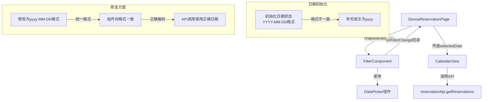

# 日期选择器年份显示错误修复设计文档

## 问题分析

### 问题描述
根据用户反馈和代码分析，目前系统存在两个日期相关问题：
1. 刷新页面时，接口调用使用"yyyy-10-24"作为日期参数，而不是具体的年份
2. 点击日期选择框选择日期时，传递的年份也是"yyyy"而非实际选择的年份

### 根本原因
通过代码检查，发现以下关键问题：

1. **日期格式化不一致**：
   - 在`DeviceReservationPage.tsx`中，初始化日期时使用了大写的`YYYY-MM-DD`格式：
     ```typescript
     const [selectedDate, setSelectedDate] = useState<string>(dayjs().format('YYYY-MM-DD'));
     ```
   - 而在`FilterComponent.tsx`中使用了小写的`yyyy-MM-DD`格式：
     ```typescript
     const [selectedDate, setSelectedDate] = useState<string>(dayjs().format('yyyy-MM-DD'));
     ```

2. **DatePicker组件配置**：
   - 在`FilterComponent.tsx`中，DatePicker组件的format属性设置为小写的`yyyy-MM-dd`：
     ```typescript
     <DatePicker
       value={selectedDate ? new Date(selectedDate) : undefined}
       onChange={handleDateChange}
       style={{ width: '180px' }}
       format="yyyy-MM-dd"
       size="small"
       getPopupContainer={() => document.body}
     />
     ```

3. **状态传递问题**：
   - 当日期从`DeviceReservationPage`传递到`FilterComponent`再传递回`DeviceReservationPage`时，格式不一致导致年份被错误处理

### 架构设计

#### 架构图


## 修复方案

### 修改点

1. **DeviceReservationPage.tsx**：
   - 将日期格式化从`YYYY-MM-DD`修改为`yyyy-MM-DD`，保持与其他组件一致

### 具体修改

修改`DeviceReservationPage.tsx`中的日期初始化代码：

```typescript
// 修改前
const [selectedDate, setSelectedDate] = useState<string>(dayjs().format('YYYY-MM-DD'));

// 修改后
const [selectedDate, setSelectedDate] = useState<string>(dayjs().format('yyyy-MM-DD'));
```

### 数据流程

1. 初始化时，所有组件使用统一的小写`yyyy-MM-DD`格式
2. 当用户选择日期时，DatePicker组件正确解析并返回日期对象
3. `FilterComponent`将日期转换为统一格式并通过回调函数传递给父组件
4. `DeviceReservationPage`更新状态并传递给`CalendarView`
5. `CalendarView`使用正确格式化的日期调用API获取预约数据

### 测试验证

修复后需要验证以下场景：
1. 页面刷新时，API调用中传递的日期参数是否包含正确的年份
2. 选择不同日期时，API调用是否使用所选日期的正确年份
3. 日期选择器UI是否正确显示年份
4. 向前/向后切换日期按钮是否正常工作

## 风险评估

| 风险 | 影响 | 缓解措施 |
|------|------|----------|
| 其他地方可能仍有大写YYYY格式 | 部分功能可能仍然存在日期问题 | 全面搜索并统一使用小写yyyy格式 |
| 日期格式修改可能影响依赖大写YYYY的现有功能 | 未知功能可能受影响 | 进行全面回归测试 |
| DatePicker组件的format配置与实际日期格式不匹配 | 日期选择器显示异常 | 确保DatePicker的format属性与实际日期格式一致 |