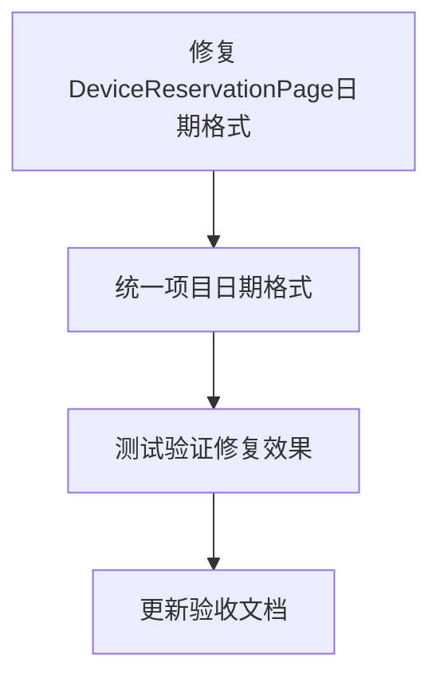

# 日期选择器年份显示错误修复任务拆分

## 任务拆分

### T1: 修复DeviceReservationPage中的日期格式初始化问题

**输入**: DeviceReservationPage.tsx文件
**输出**: 修改后的文件，将YYYY-MM-DD格式改为yyyy-MM-DD
**实现约束**:
- 使用dayjs库的正确格式
- 保持其他代码不变
**依赖关系**: 无

### T2: 检查并统一项目中的日期格式

**输入**: 项目代码库
**输出**: 项目中所有使用日期格式化的地方统一为小写yyyy格式
**实现约束**:
- 重点检查FilterComponent.tsx, CalendarView.tsx等关键组件
- 确保DatePicker组件的format属性与实际日期格式一致
**依赖关系**: T1完成后进行

### T3: 测试验证修复效果

**输入**: 修改后的代码
**输出**: 验证报告，确认问题是否解决
**实现约束**:
- 验证页面刷新时API调用是否使用正确日期
- 验证选择日期时API调用是否使用正确年份
- 验证日期选择器UI显示是否正常
- 验证日期切换按钮功能是否正常
**依赖关系**: T1和T2完成后进行

### T4: 更新验收文档

**输入**: 修改后的代码和测试结果
**输出**: 更新后的验收文档
**实现约束**:
- 记录修复内容和验证结果
**依赖关系**: T3完成后进行

## 任务依赖图

## 风险评估

| 风险 | 风险等级 | 缓解措施 |
|------|----------|----------|
| 修改日期格式可能影响其他依赖功能 | 中 | 进行全面测试，确保所有功能正常 |
| 可能存在未发现的其他日期格式不一致问题 | 低 | 全面搜索项目中的日期格式化代码 |
| 前端日期格式修改可能与后端期望格式不匹配 | 低 | 确认后端API接收的日期格式要求 |

## 验收标准

1. 页面刷新时，API调用中传递的日期参数包含正确的年份（例如2025-10-24）
2. 选择不同日期时，API调用使用所选日期的正确年份
3. 日期选择器UI正确显示年份，不再显示yyyy占位符
4. 向前/向后切换日期按钮功能正常
5. 所有相关功能正常工作，无新的错误出现