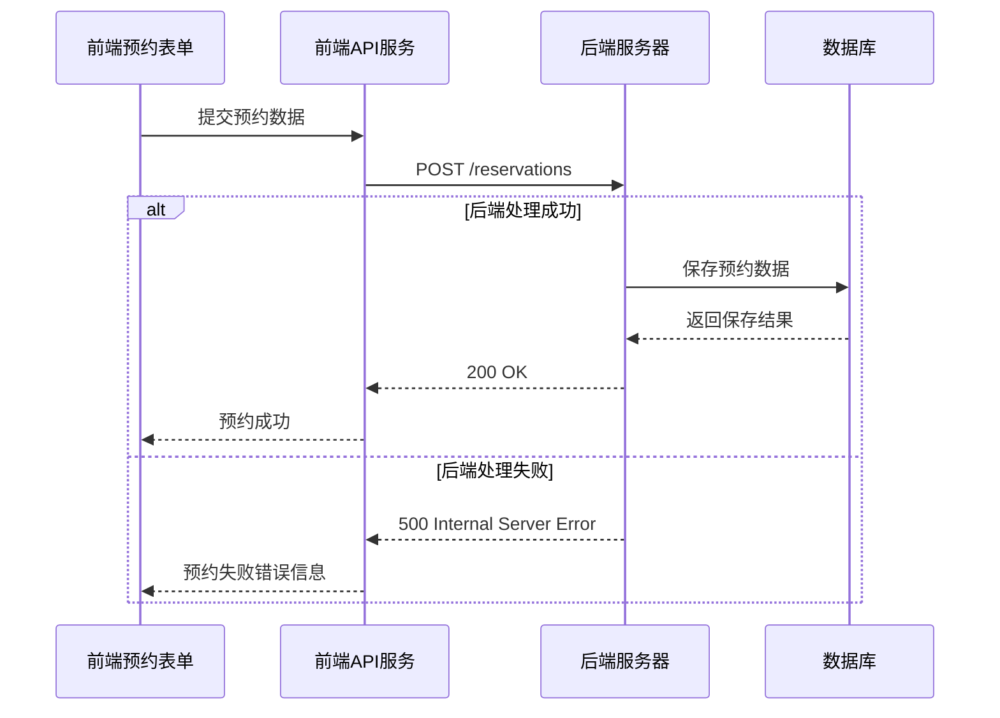

# 架构设计：修复预约提交报错

## 架构图

## 模块划分和依赖关系

### 前端模块
- **ReservationFormModal.tsx**: 预约表单组件，处理用户输入和提交逻辑
- **api.ts**: API服务，处理与后端的通信

### 后端模块
- **预约API端点**: 处理预约请求的Controller
- **预约Service**: 业务逻辑层
- **数据访问层**: 数据库操作

## 接口定义和数据流

### 前端请求
- URL: /reservations
- Method: POST
- 请求体结构: 预约相关数据（需检查具体字段）

### 后端响应
- 成功: 200 OK + 预约信息
- 失败: 500 Internal Server Error

## 错误处理机制
1. 前端捕获API错误并显示友好提示
2. 后端应该提供详细的错误日志和适当的错误码
3. 数据验证失败应该返回4xx错误而不是500错误