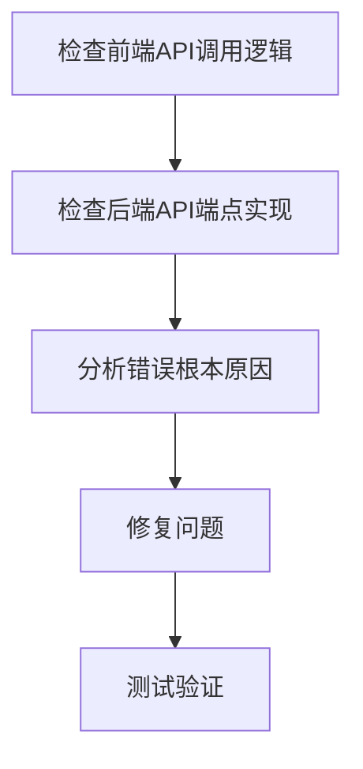

# 任务拆分：修复预约提交报错

## 任务依赖图

## 任务清单

### 任务1: 检查前端API调用逻辑
- **输入**: ReservationFormModal.tsx和api.ts文件
- **输出**: 确认前端数据格式和API调用方式是否正确
- **实现约束**: 使用React、TypeScript和axios
- **依赖关系**: 无

### 任务2: 检查后端API端点实现
- **输入**: 后端代码（特别是预约相关的Controller和Service）
- **输出**: 确认后端处理逻辑和数据验证规则
- **实现约束**: Java Spring框架
- **依赖关系**: 任务1

### 任务3: 分析错误根本原因
- **输入**: 前后端代码分析结果
- **输出**: 确定导致500错误的具体原因
- **实现约束**: 基于代码分析
- **依赖关系**: 任务2

### 任务4: 修复问题
- **输入**: 错误根本原因
- **输出**: 修复后的代码
- **实现约束**: 遵循现有代码风格和架构
- **依赖关系**: 任务3

### 任务5: 测试验证
- **输入**: 修复后的代码
- **输出**: 验证报告
- **实现约束**: 确保前后端功能正常
- **依赖关系**: 任务4