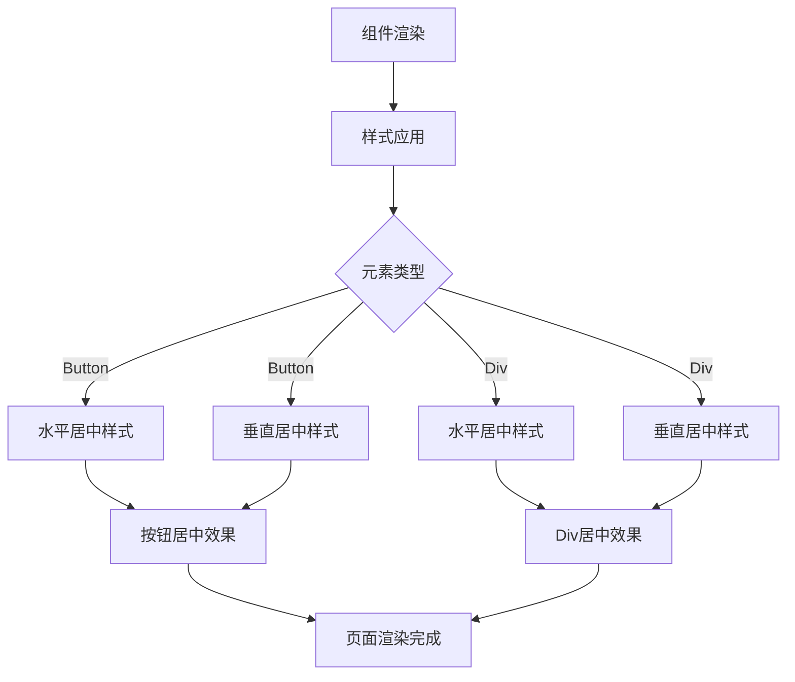

# 元素文案居中对齐 - 设计文档

## 架构概述

本设计文档详细说明如何实现所有button和div元素文案的居中对齐功能。方案将遵循现有项目的技术架构，利用React的样式系统和CSS属性来实现居中效果。

## 布局架构图



## 模块划分

### 1. 元素识别模块
- 负责查找并识别需要居中对齐的button和div元素
- 重点关注包含文本内容的交互元素

### 2. 样式应用模块
- 为识别的元素应用适当的居中样式
- 区分不同类型元素的居中实现方式

### 3. 验证测试模块
- 验证居中效果是否符合预期
- 确保功能正常且无样式冲突

## 接口定义

本任务主要涉及前端样式修改，不需要定义新的API接口。主要使用以下CSS属性：

```typescript
// 水平居中样式
const horizontalCenter = {
  textAlign: 'center' as const
};

// 垂直居中样式 - 方法1：Flexbox
const verticalCenterFlexbox = {
  display: 'flex' as const,
  alignItems: 'center' as const,
  justifyContent: 'center' as const
};

// 垂直居中样式 - 方法2：Line Height
const verticalCenterLineHeight = (height: string) => ({
  lineHeight: height
});
```

## 错误处理机制

| 错误类型 | 处理方式 |
|----------|----------|
| 样式冲突 | 检查现有样式，使用!important或更具体的选择器 |
| 居中效果不佳 | 尝试不同的居中方法组合 |
| 响应式问题 | 添加媒体查询确保在不同尺寸下正常显示 |

## 具体实现方案

### 方案1：为单个元素添加内联样式

为每个需要居中的button和div元素直接添加内联样式：

```tsx
// Button元素示例
<Button style={{ textAlign: 'center', display: 'flex', alignItems: 'center', justifyContent: 'center' }}>
  按钮文本
</Button>

// Div元素示例
<div style={{ textAlign: 'center', display: 'flex', alignItems: 'center', justifyContent: 'center' }}>
  Div文本
</div>
```

**优点**：针对性强，不影响其他元素
**缺点**：代码重复，维护困难

### 方案2：使用CSS类或全局样式

创建CSS类来统一管理居中样式：

```css
/* 在CSS文件中 */
.center-text {
  text-align: center;
}

.center-content {
  display: flex;
  align-items: center;
  justify-content: center;
}

/* 在组件中使用 */
<Button className="center-text center-content">按钮文本</Button>
<div className="center-text center-content">Div文本</div>
```

**优点**：样式统一，易于维护
**缺点**：可能影响未预期的元素

### 方案3：组合使用方案1和方案2

对于关键元素使用内联样式确保精准控制，对于大量相似元素使用CSS类：

```tsx
// 关键元素使用内联样式
<Button style={{ textAlign: 'center' }}>特殊按钮</Button>

// 普通元素使用CSS类
<div className="center-content">普通Div</div>
```

**优点**：兼顾精准控制和代码复用
**缺点**：需要更多的样式管理工作

## 选择的实现方案

基于项目现状和需求，我选择采用**方案1**作为主要实现方式，原因如下：

1. 针对性强，可以精确控制每个需要居中的元素
2. 不会影响其他未预期的元素
3. 实现简单，风险最小
4. 符合之前按钮文案居中任务的实现模式

在具体实施时，我会优先检查现有的样式设置，确保新添加的样式不会与现有样式冲突。