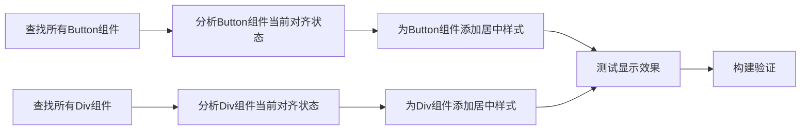

# 元素文案居中对齐 - 任务拆分文档

## 任务依赖图

## 原子任务列表

| 任务ID | 任务名称 | 输入 | 输出 | 实现约束 | 依赖任务 |
|--------|---------|------|------|----------|----------|
| T1 | 查找所有Button组件 | 项目代码库 | Button组件列表 | 使用代码搜索工具 | 无 |
| T2 | 分析Button组件当前对齐状态 | Button组件代码 | 对齐状态分析报告 | 检查style属性 | T1 |
| T3 | 为Button组件添加居中样式 | Button组件代码 | 修改后的Button组件 | 使用textAlign: 'center'等属性 | T2 |
| T4 | 查找所有Div组件 | 项目代码库 | Div组件列表 | 使用代码搜索工具 | 无 |
| T5 | 分析Div组件当前对齐状态 | Div组件代码 | 对齐状态分析报告 | 检查style属性 | T4 |
| T6 | 为Div组件添加居中样式 | Div组件代码 | 修改后的Div组件 | 使用Flexbox或textAlign等属性 | T5 |
| T7 | 测试显示效果 | 修改后的代码 | 显示效果验证报告 | 在开发环境中验证 | T3, T6 |
| T8 | 构建验证 | 修改后的代码 | 构建结果报告 | 执行npm run build命令 | T7 |

## 详细任务说明

### T1: 查找所有Button组件

**描述**：在项目代码库中查找所有Button组件的使用情况。

**输入**：
- 项目代码库，特别是组件目录

**输出**：
- Button组件列表，包括文件路径和行号

**实现约束**：
- 使用search_codebase或search_by_regex工具
- 重点关注ReservationCalendar.tsx等主要组件文件

### T2: 分析Button组件当前对齐状态

**描述**：分析找到的Button组件当前的样式和对齐状态。

**输入**：
- T1找到的Button组件代码

**输出**：
- 对齐状态分析报告，标识需要修改的组件

**实现约束**：
- 检查是否已设置textAlign等居中属性
- 记录需要添加居中样式的组件

### T3: 为Button组件添加居中样式

**描述**：为需要居中的Button组件添加适当的样式。

**输入**：
- T2分析的Button组件代码

**输出**：
- 修改后的Button组件代码

**实现约束**：
- 添加textAlign: 'center'属性
- 保持其他现有样式不变
- 使用update_file工具进行修改

### T4: 查找所有Div组件

**描述**：在项目代码库中查找包含文本内容的Div组件。

**输入**：
- 项目代码库

**输出**：
- Div组件列表，包括文件路径和行号

**实现约束**：
- 使用search_codebase或search_by_regex工具
- 重点关注包含文本的div元素，特别是下拉选择框等交互组件

### T5: 分析Div组件当前对齐状态

**描述**：分析找到的Div组件当前的样式和对齐状态。

**输入**：
- T4找到的Div组件代码

**输出**：
- 对齐状态分析报告，标识需要修改的组件

**实现约束**：
- 检查是否已设置textAlign、display等居中属性
- 记录需要添加居中样式的组件

### T6: 为Div组件添加居中样式

**描述**：为需要居中的Div组件添加适当的样式。

**输入**：
- T5分析的Div组件代码

**输出**：
- 修改后的Div组件代码

**实现约束**：
- 为简单文本div添加textAlign: 'center'
- 为需要垂直居中的div添加display: 'flex', alignItems: 'center', justifyContent: 'center'
- 保持其他现有样式不变
- 使用update_file工具进行修改

### T7: 测试显示效果

**描述**：在开发环境中测试修改后的显示效果。

**输入**：
- T3和T6修改后的代码

**输出**：
- 显示效果验证报告

**实现约束**：
- 使用开发服务器的热更新功能
- 检查不同屏幕尺寸下的显示效果

### T8: 构建验证

**描述**：执行构建命令，确保修改不会导致编译错误。

**输入**：
- T3和T6修改后的代码

**输出**：
- 构建结果报告

**实现约束**：
- 执行npm run build命令
- 验证构建是否成功
- 检查是否有警告或错误